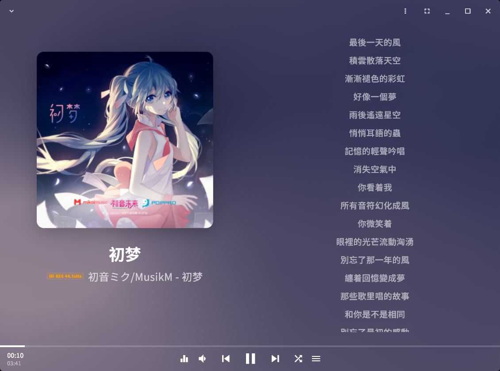

# StellaTune

English | [简体中文](README_zh.md)

> A next-generation, cross-platform music player designed for audiophiles and tinkerers alike.
>
> Status: Early stage / WIP. StellaTune is under active development, and APIs, plugin interfaces, and user-facing features may change frequently.
> Platform support priority currently focuses on Windows first, then the rest of the desktop platforms, and mobile platforms last.

StellaTune is not just another music player; it is an open-source, extensible audio platform built with a beautiful **Flutter** user interface and a blazing-fast, memory-safe **Rust** core. Whether you are managing a massive local library or streaming through custom plugins, StellaTune delivers an uncompromising audio experience.

---

## Key Features

- **Audiophile Grade Audio**: Pursuing true high-fidelity and low-latency playback. The Rust-first audio pipeline
  ensures that your music is delivered exactly as it was meant to be heard, without compromise.
- **Cross-Platform Excellence**: Built from the ground up to be truly cross-platform. Enjoy a fluid, responsive, and
  native-feeling UI across desktop (Windows, macOS, Linux) and mobile platforms, all unified under a robust Rust core.
- **Powerful Plugin Ecosystem**: TypeScript plugins extend source resolution, search, authentication, lyrics, and other
  control-plane capabilities. Audio decoding, DSP, and output remain in the native Rust data plane, with separately
  distributed native sidecars available for licensed integrations such as ASIO.
- **Modern Local Library**: A carefully crafted, aesthetically pleasing user experience designed for the modern music
  lover to effortlessly build, organize, and enjoy their local collection.

## Screenshots



---

## Getting Started

### For Users
*(Pre-compiled binaries and installers for Windows, macOS, and Linux will be available in the Releases page soon.)*

### For Developers

StellaTune welcomes developers to build upon its core foundation or create amazing new plugins for the community.

#### Prerequisites

To build StellaTune from source, you will need:
- [Flutter SDK](https://flutter.dev/docs/get-started/install) 3.47.2 / Dart 3.13.2 (or FVM)
- [Rust toolchain](https://rustup.rs/) 1.98.0
- [Node.js 20](https://nodejs.org/) (needed for specific plugin packaging and sidecar services)

Prepare your environment by installing the code generator:

```bash
cargo install flutter_rust_bridge_codegen --version 2.13.0 --locked
```

#### Running the Desktop App (Example: Windows)

```bash
cd apps/stellatune
flutter pub get
flutter_rust_bridge_codegen generate
flutter run -d windows
```
*Note: The Rust backend artifacts are automatically built during the `flutter run` or `flutter build` process.*

---

## Plugin Development

StellaTune plugins are pre-bundled TypeScript modules loaded by the shared Node runner. They provide declarative source plans and control-plane capabilities; media bytes and PCM never pass through Node. Native Rust stages own decoding and DSP, while optional external native processes connect through the sidecar protocol.

Want to build your own extension? Check out our technical guides:
- [TypeScript Plugin Quickstart](docs/typescript-plugin-quickstart.md)
- [Plugin Runtime Architecture](docs/stellatune-audio-architecture.md)

---

## Architecture & Monorepo

The StellaTune monorepo is thoughtfully structured to separate concerns while making development straightforward:

- **`apps/stellatune`**: The main user-facing application (Flutter desktop/mobile).
- **`apps/stellatune-tui`**: A terminal user interface (Rust TUI) leveraging the same core.
- **`crates/stellatune-audio*`**: The core audio runtime, pipeline, and playback adapters.
- **`crates/stellatune-plugins`**: TypeScript plugin package management and process runtime.
- **`crates/plugins-native`**: Native protocols and separately distributed sidecars.
- **`tools/typescript-plugin-runtime`**: Shared Node runner and TypeScript plugin SDK definitions.

---

## Contributing

We welcome contributions of all sizes! Whether it's reporting bugs, discussing new features, or submitting code, your help is appreciated.

- **Small, focused PRs** are the best way to get your code merged quickly.
- Please use **Conventional Commits** for your commit messages.
- If you're modifying CI-sensitive code, ensure you run local checks before pushing:

```bash
cargo fmt --all -- --check
cargo clippy --all-targets --all-features -- -D warnings
```

For Flutter UI changes:
```bash
cd apps/stellatune
flutter analyze
flutter build windows --debug
```

## License

[MIT License](LICENSE) (or see individual crate licenses where applicable).
