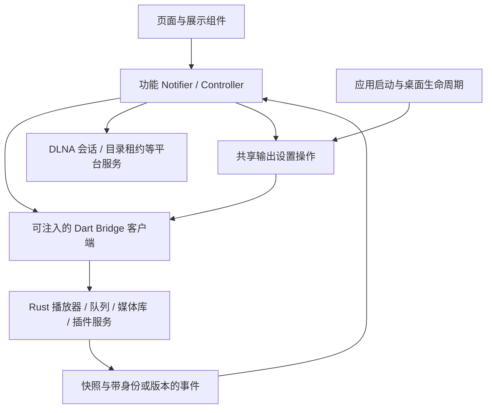

# Flutter 代码审查（2026-09-08）

审查基线：`7e294d7`（ASIO 输出插件接入）。范围：`apps/stellatune/lib`、`test`、`tool`、平台启动和打包配置；为核实数据边界，同时检查了 Rust 的 FFI 和队列事件出口。下方发现和行号保留审查时的基线，整改结果见文末；不要将基线统计当作整改后统计。

## 结论

目前适合继续使用 **Riverpod Notifier + 展示组件 + Rust 应用服务**。不需要重写为 BLoC，也不需要给每个操作增加 Repository、UseCase、Command 三层包装。

主要维护成本来自三个方面：

1. **少数对象承担过多职责。** 曲目列表包含完整转码流程，设置页面同时负责输出切换、插件管理、缓存和持久化同步，PlaybackController 同时管理本地和 DLNA 播放。
2. **状态的所有者和异步提交规则不统一。** 一部分本地导航已有 generation、队列已有 revision，但插件歌单、输出设备、DLNA 轮询和媒体库刷新没有一致地沿用这些机制。已经存在可以从代码推导的卡住、旧结果覆盖和状态不同步路径。
3. **检查与实际生产路径存在缺口。** 两个手写 Dart 文件超过 1200 有效 LOC；现有 LOC 门禁只检查 Rust；Flutter CI 不运行现有 Dart 测试；取色竞态测试覆盖的 provider 未被详情页使用。

这里既有需要拆分的实现，也有可以删除的提前抽象。优先修复状态流和生命周期，再沿职责边界拆模块，比单纯把文件切短更有价值。

## 审查方法、规模与验证

### 有效 LOC 的口径

采用 Dart analyzer 的词法 token 统计：一行只要包含非注释 token 就计为一行；忽略纯空白行和纯注释行；括号、声明、import、字符串内容仍属于代码。多行字符串中的非空内容行计入。此口径不是“可执行语句数”，也不是复杂度指标。

统计 `lib/`、`test/`、`tool/` 下的 Dart 文件。排除生成的 FRB/API/third_party 和 l10n Dart 文件；`lib/bridge/bridge.dart` 与手写 barrel `lib/bridge/api.dart` 保留。排除名单不能简单写成整个 `bridge/`，否则会漏掉真正维护的桥接代码。

| 范围 | 手写 Dart 文件 | 有效 LOC | 物理行 |
| --- | ---: | ---: | ---: |
| `lib/` | 116 | 24,037 | 26,045 |
| `test/` | 12 | 1,856 | 1,954 |
| `tool/` | 1 | 86 | 92 |
| 合计 | 129 | 25,979 | 28,091 |

另有 20 个生成文件，未计入手写代码的 1200 行限制。PowerShell 工具脚本、平台原生代码和资源不包含在上述 Dart 数字中。

最大的手写文件如下。**只有前两项超过 1200 有效 LOC**；不能把其他文件因为接近 1200 物理行也算作违规。

| 文件（相对 `apps/stellatune/`） | 有效 LOC | 物理行 | 判断 |
| --- | ---: | ---: | --- |
| `lib/ui/widgets/track_list.dart` | **1,673** | 1,765 | 超限，转码用例混入列表 |
| `lib/ui/pages/settings_page.dart` | **1,483** | 1,582 | 超限，页面和运行时操作混合 |
| `lib/player/playback_controller.dart` | 1,100 | 1,200 | 未超限，但职责过多 |
| `lib/ui/pages/playlists_page.dart` | 932 | 991 | 未超限，请求状态值得独立 |
| `lib/ui/pages/home/widgets/home_page_widgets.dart` | 706 | 753 | 无需仅因行数拆分 |
| `lib/ui/pages/playlists/widgets/playlists_sidebar_widgets.dart` | 699 | 732 | 无需仅因行数拆分 |
| `lib/ui/pages/library_page.dart` | 631 | 672 | 继续分清页面状态和查询状态 |
| `lib/ui/widgets/now_playing_common/now_playing_progress_bar.dart` | 591 | 656 | 交互复杂度有实际来源 |
| `test/home_visual_test.dart` | 550 | 567 | 多主题、多尺寸布局验证 |
| `lib/ui/pages/playlists/widgets/playlist_track_panes.dart` | 535 | 568 | 未超限 |
| `lib/ui/pages/music_detail/widgets/queue_drawer_panel.dart` | 498 | 528 | 未超限 |
| `lib/bridge/bridge.dart` | 470 | 570 | 有边界作用，但资源管理可独立 |

### 已执行的检查

在本机 Windows、项目已有依赖环境中执行：

```powershell
cd apps/stellatune
flutter analyze --no-pub
flutter test --no-pub --reporter compact
```

- Analyze：通过，无 issue。
- Flutter tests：**79 项通过**，约 36 秒；其中 `widget_test.dart` 的一项只是 `expect(true, isTrue)`，不能视为启动覆盖。
- 对所有手写 Dart 做有效 LOC 统计，并核对大文件职责、调用方、事件来源和测试注入入口。
- 未操作真实 DLNA 设备、macOS 沙盒，也未以发行安装目录启动应用。下文运行时风险均标明代码触发条件；通过现有测试不等于这些路径已验证。

### 与主流架构建议的对照

Flutter 官方建议分开 UI 和数据访问、把展示逻辑移出 Widget，并明确说明 Domain/UseCase 层是按复杂度选择的，不能机械套用。这里 Rust 已经承担播放队列、插件运行时、媒体库等业务职责，因此 Dart 应以桥接客户端和界面状态投影为主，不再复制这些业务规则。[Flutter 架构建议](https://docs.flutter.dev/app-architecture/recommendations)

将现有 Notifier 视为 ViewModel、Bridge 视为外部服务客户端即可。只有承担共享缓存、同步或生命周期的对象才值得建立独立数据层组件；不要求每个 FFI 方法都再包装一次。[Flutter 架构指南](https://docs.flutter.dev/app-architecture/guide)

Riverpod 提供选择性订阅与 provider override，项目已经使用这些能力。应在高频更新边界和实际业务测试中继续使用，而不是替换状态管理库；性能优化的收益仍应测量。[选择性订阅](https://riverpod.dev/docs/how_to/select)、[Provider 测试](https://riverpod.dev/docs/how_to/testing)

## 发现及优先级

P1：有明确触发路径、影响核心功能或应用可用性，应优先修复。P2：已存在结构、状态或质量保障问题，应在相关模块整理时处理。P3：可以顺手简化，不应抢占前两类工作。不是安全审计分级。

| 编号 | 级别 | 问题 | 主要维度 |
| --- | --- | --- | --- |
| F01 | P1 | 插件歌单快速切换可能永久卡在 loading | 请求状态所有权 |
| F02 | P1 | Flutter 缺少后端队列变更订阅 | Rust/Flutter 数据边界 |
| F03 | P1 | 托盘资源依赖源码路径，发行环境隐藏窗口后可能无法恢复 | 平台生命周期 |
| F04 | P2 | 设置页面维护多份输出状态，应用与持久化顺序不一致 | 架构、模块化 |
| F05 | P2 | TrackList 内嵌完整转码业务 | 可复用性、模块化 |
| F06 | P2 | PlaybackController 混合本地与 DLNA 会话 | 架构、异步生命周期 |
| F07 | P2 | 媒体库刷新错误和旧结果没有统一处理 | 状态维护 |
| F08 | P2 | 详情页取色重复，生产路径缺少过期保护 | 复用、测试有效性 |
| F09 | P2 | 详情页页面级订阅把进度刷新带入布局状态 | 更新边界 |
| F10 | P2 | 目录访问租约未覆盖部分失败和并发获取 | 资源所有权 |
| F11 | P2 | Dart LOC 和现有测试未进入 CI 门禁 | 持续可维护性 |
| F12 | P2 | 启动失败只有日志，没有可见失败状态 | 生命周期、错误表达 |
| F13 | P3 | 本地稀疏分页抽象没有实际分页消费者 | 过度设计 |

### F01：插件歌单快速切换可能永久卡在 loading

证据：[歌单选择和加载入口](../apps/stellatune/lib/ui/pages/playlists_page.dart#L745)、[加载清理](../apps/stellatune/lib/ui/pages/playlists_page.dart#L890)、[侧栏选择入口](../apps/stellatune/lib/ui/pages/playlists/widgets/playlists_sidebar_widgets.dart#L140)。

触发顺序：

1. 选择 A，首屏请求未结束，`_loadingPluginPlaylistTracks = true`。
2. 选择 B，页面先把 `_selectedPluginPlaylistKey` 改成 B。
3. B 的 `_loadPluginPlaylistTracks()` 因同一个 loading 标志直接返回，未发请求，也未生成新请求序号。
4. A 返回后发现选择已变，放弃结果；其 `finally` 同样要求当前仍选择 A，因此没有清除 loading。

结果是 B 空白并一直加载，后续选择也被同一标志拦截。这说明“选中哪个歌单”和“哪个请求拥有 loading”没有形成一个完整状态。

**建议：** 将插件歌单的选择、分页、缓存和加载状态收进一个专用 Notifier。新选择取代旧请求，状态绑定 selection key 和 generation；不能用全页 busy 标志禁止另一个选择的首屏加载。先修竞态，再迁移文件，避免把错误原样搬过去。

**验收：** 用两个可控 Future 模拟 A 未完成时选择 B；分别让 A 成功、失败及晚于 B 完成，最终必须显示 B，且可以继续切换和分页。

### F02：Flutter 缺少后端队列变更订阅

证据：[Flutter 事件订阅](../apps/stellatune/lib/player/playback_controller.dart#L71)、[FFI 播放事件枚举](../crates/stellatune-ffi/src/api/player/types.rs#L183)、[服务层队列订阅](../crates/stellatune-backend-api/src/player_service/queue.rs#L124)、[HTTP SSE 使用该订阅](../crates/stellatune-backend-api/src/host_api/handlers.rs#L189)。

后端已有 `subscribe_queue()`，HTTP 会发出 `queueChanged`。Flutter 的桥接只订阅播放/歌词事件，队列主要依靠 Flutter 命令响应和切歌事件顺便刷新。插件通过 HTTP 仅追加、删除歌曲或改变队列模式而没有切歌时，Flutter 没有对应更新通知。

同一边界还有元数据问题：[队列投影](../apps/stellatune/lib/player/queue_controller.dart#L35) 按数组索引读取补充元数据，[追加操作](../apps/stellatune/lib/player/playback_controller.dart#L539) 拼接操作前的旧列表与新条目；[FFI 快照](../crates/stellatune-ffi/src/api/player/queue.rs#L40) 的元数据映射主要来自本地曲目。等待期间另一个入口修改队列时，索引不再是稳定的关联键；外部歌曲通过 HTTP 新增或重启恢复时，也不能依赖 Dart 进程里上一次保存的标题。

**建议：** 把既有服务层队列通知接入 FRB，使用“先订阅、再取快照、按 revision 拒绝旧状态”的投影。命令返回值可以加速反馈，但不能是唯一更新来源。曲目展示信息按 `itemId`/`trackId` 关联，并由共享服务完整提供外部曲目元数据。沿用已有 revision 保护，不再增加一套通用事件总线。

**验收：** HTTP 入队/删队/改模式无需播放即可更新 Flutter；重复曲目和并发追加不会串标题；恢复外部歌曲队列不依赖旧页面对象。此项需要同时调整 FFI，单改 Dart 不够。

### F03：托盘资源依赖源码路径

证据：[托盘初始化](../apps/stellatune/lib/platform/tray_service.dart#L22)、[默认关闭设置](../apps/stellatune/lib/app/settings_store.dart#L329)、[关闭后隐藏窗口](../apps/stellatune/lib/app/app_bootstrap.dart#L255)。

图标使用 `windows/runner/resources/app_icon.ico` 等相对源码路径；文件不存在时跳过 `setIcon()`，但初始化仍标记成功。当前资源声明和 Windows 安装规则没有把这些源码目录按该路径放入发行包，而“关闭到托盘”默认开启。

**风险：** 从正常安装目录启动时可能没有托盘入口，关闭操作却直接隐藏窗口；原本用于恢复窗口的入口不存在。是否还会遇到平台 API 错误取决于平台实现，本次没有做发行目录实测。

**建议：** 将托盘图标纳入明确的运行时资源，按安装位置或 Flutter asset 解析。托盘服务返回真实可用状态，窗口关闭逻辑只有在可恢复入口就绪时才隐藏；失败时执行正常退出。这个可用性判断应属于桌面生命周期协调，不散落到各页面。

**验收：** 在不含源码、工作目录与安装目录不同的环境启动发行包，验证关闭、托盘恢复和退出；模拟图标缺失时仍能正常退出。

### F04：设置页面维护多份输出状态，应用与持久化顺序不一致

证据：[会话状态](../apps/stellatune/lib/app/settings_store.dart#L15)、[页面字段及恢复](../apps/stellatune/lib/ui/pages/settings_page.dart#L69)、[build 中写回会话](../apps/stellatune/lib/ui/pages/settings_page.dart#L223)、[启动层依赖设置 UI 工具](../apps/stellatune/lib/app/app_bootstrap.dart#L8)。

持久化 SettingsState、可变 OutputSettingsUiSession、SettingsPageState 都保存后端/目标/重采样质量。页面通过 restore/persist/load 手工搬运，Future、缓存、ready 标志又各自表示数据是否可用。`_SettingsRuntimeOps` 等 extension 只是对同一个 State 分组，不能形成独立生命周期或测试边界。

已经出现两类具体问题：

- [本地输出切换](../apps/stellatune/lib/ui/pages/settings_page.dart#L791)、[设备切换](../apps/stellatune/lib/ui/pages/settings_page.dart#L1201)、[重采样配置](../apps/stellatune/lib/ui/pages/settings_page.dart#L1360) 先写持久化，再请求 Rust 应用；失败时没有对等回滚。插件路由则是先应用、后持久化，同一类操作的确认语义不同。
- [枚举插件设备](../apps/stellatune/lib/ui/pages/settings_page.dart#L662) 用全局 loading 拦截，但返回后只检查 mounted，没有检查请求的后端是否仍是当前选择；快速选择另一个后端时，旧结果仍可写入设备和目标字段。

**建议：** 独立 `OutputSettingsController` 管理“已确认设置、待应用草稿、设备加载结果、错误”；已确认字段只保留一个来源，草稿可以独立。用明确的选择 generation 处理枚举失效；统一应用成功后的持久化和失败反馈。把路由解析和应用流程移出 `ui/pages/settings/`，bootstrap 和设置页共用。插件列表/安装操作由单独的插件管理控制器负责，设置页只组织板块和展示操作结果。

**验收：** 模拟设备打开失败，UI 与保存值保留已确认状态；后端 A 枚举晚于 B 返回不污染 B；关闭设置页不改变已应用路由；启动代码不再 import 设置页实现。

### F05：TrackList 内嵌完整转码业务

证据：[列表依赖 PlayerBridge](../apps/stellatune/lib/ui/widgets/track_list.dart#L44)、[编码器发现](../apps/stellatune/lib/ui/widgets/track_list.dart#L761)、[转码配置](../apps/stellatune/lib/ui/widgets/track_list.dart#L932)、[启动和订阅任务](../apps/stellatune/lib/ui/widgets/track_list.dart#L1056)、[进度弹窗](../apps/stellatune/lib/ui/widgets/track_list.dart#L1380)。

这个 1673 有效行的“列表组件”同时负责 encoder 查询、schema 表单、保存文件选择、任务启动/取消、进度订阅和完成反馈。列表渲染、重排、鼠标行为与转码生命周期没有必要绑定；另一个页面要复用转码时，目前只能依赖整个列表或复制内部流程。

**建议：** 拆为转码任务控制器、参数弹窗和进度视图，放在 `transcode/` 功能内；列表只发出 `onTranscodeRequested(track)`。转码订阅的关闭和取消由任务控制器拥有。列表自己的滚动、选择、重排仍留在列表，不按每条回调机械建类。

**验收：** 不构建 TrackList 也能测试取消、流错误、完成后清理；列表文件降到 1200 有效行以内，且不直接依赖编码器发现和任务流 API。

### F06：PlaybackController 混合本地与 DLNA 会话

证据：[控制器依赖及静态 DlnaBridge](../apps/stellatune/lib/player/playback_controller.dart#L24)、[DLNA 轮询](../apps/stellatune/lib/player/playback_controller.dart#L223)、[输出切换](../apps/stellatune/lib/player/playback_controller.dart#L391)。

控制器尚未超 LOC，但同时处理本地命令、身份注册、队列投影、目录授权、DLNA 控制/轮询/音量、恢复和插件可播放性。静态创建的 DlnaBridge 也无法像 PlayerBridge 一样直接通过 provider 替换。

`_pollDlna()` 开始时检查当前输出，等待旧设备的两个网络请求后直接写当前播放状态；期间切回本地或另一台设备，旧结果仍会覆盖当前位置/状态，甚至参与自动下一首判断。本地导航已有 generation，未覆盖这些输出会话操作。

**建议：** 先提取可注入的 `DlnaPlaybackSession`，由它拥有 renderer 身份、网络调用、轮询与租约。每次输出切换使旧 session 失效，任何异步返回写状态前检查 session/generation。PlaybackController 保留用户意图协调和界面投影。暂不建立支持任意 transport 的庞大插件框架，也不因形式统一就把全部 DLNA 逻辑迁入 Rust。

**验收：** 暂停旧设备的轮询响应，切回本地后再释放响应，本地状态和队列位置必须不变；所有测试可注入模拟 DLNA 服务。

### F07：媒体库刷新错误和旧结果没有统一处理

证据：[初始化](../apps/stellatune/lib/library/library_controller.dart#L194)、[曲目查询](../apps/stellatune/lib/library/library_controller.dart#L245)、[变更事件触发刷新](../apps/stellatune/lib/library/library_controller.dart#L345)、[LibraryState.copyWith](../apps/stellatune/lib/library/library_state.dart#L86)。

一次 changed 事件通过 `unawaited()` 发出多组查询，这些 Future 没有自己的错误处理。事件流的 `onError` 无法捕获回调里另外启动的异步查询错误。曲目查询虽然检查筛选条件是否变化，但同一条件的两次查询没有请求序号，旧结果仍可能晚到并覆盖新结果。

错误状态本身也有确定缺陷：`lastError`、`lastFinishedMs` 的 copyWith 用 `参数 ?? 旧值`，调用方传入 `null` 无法清空，尽管开始扫描和查询成功都明确尝试清空。项目的 LyricsState 和 SettingsState 已有正确的 sentinel 写法，无需重新设计机制。

**建议：** 在控制器内建立可合并的刷新入口，查询负责把失败转成可见状态；按查询类别/条件使用请求序号，不能用一个序号相互作废无关查询。统一 nullable copyWith 的清空语义。相同的提交规则还应核对 [播放启动快照恢复](../apps/stellatune/lib/player/playback_controller.dart#L140)：等待快照、队列与租约后直接写回，缺少与期间新播放事件的版本协调。

**验收：** 查询失败不逃逸到全局 Zone；相同条件的旧结果不覆盖新结果；成功后错误可清空；旧启动快照不会覆盖后来收到的曲目事件。

### F08：详情页取色重复，生产路径缺少过期保护

证据：[桌面取色](../apps/stellatune/lib/ui/pages/music_detail/desktop_music_detail_page.dart#L115)、[移动端取色](../apps/stellatune/lib/ui/pages/music_detail/mobile_music_detail_page.dart#L98)、[未被生产 UI 引用的 provider](../apps/stellatune/lib/ui/theme/artwork_palette_provider.dart#L49)、[对应测试](../apps/stellatune/test/artwork_palette_test.dart#L68)。

两份详情页实现都在异步前记录 `_lastLoadedCover`，返回后只检查 mounted。如果 A 取色比 B 慢，B 封面可能配上 A 的颜色。首次失败也已记录路径，缺少同一路径重试机会。现有过期结果测试验证的是另一条 provider 链路，不能证明实际详情页安全。

**建议：** 保留用户已要求恢复的详情页旧取色算法，只共享执行、缓存与失效保护；桌面和移动端使用同一生产入口。不要为复用直接切回另一种视觉算法。清理或重新定位未使用的 provider 和专属测试；仍被固定主题使用的 palette/ThemeExtension 不能一起误删。

**验收：** 对实际详情页使用的执行入口注入慢 A、快 B，最终只允许 B 更新；图片暂时缺失后可以重试；主界面仍使用固定主题。

### F09：详情页页面级订阅把进度刷新带入布局状态

证据：[桌面全量订阅](../apps/stellatune/lib/ui/pages/music_detail/desktop_music_detail_page.dart#L180)、[build 中更新歌词布局状态](../apps/stellatune/lib/ui/pages/music_detail/desktop_music_detail_page.dart#L216)、[移动端全量订阅](../apps/stellatune/lib/ui/pages/music_detail/mobile_music_detail_page.dart#L163)。

详情页同时 watch 完整播放、队列、歌词状态，播放进度也会触发整页 build。桌面 build 又参与歌词布局切换和延迟计时器状态更新，普通进度刷新可能提前取消本应延迟的布局切换。这既是订阅范围问题，也让动画时序取决于无关状态通知。

**建议：** 曲目身份/封面、进度、歌词分别订阅所需字段，把曲目和歌词变化的动画协调放入监听或独立组件。直接复用首页已有的选择性订阅做法；先加 build 计数和固定时序测试，再用 profile 测量。仅从代码不能断言真实设备上已经掉帧，也不建议给全部组件盲目增加 RepaintBoundary。

**验收：** 进度 tick 不重建封面与静态布局；歌词切换延迟不受进度更新频率影响；通过 profile 记录修改前后的 build/raster 情况。

### F10：目录访问租约未覆盖部分失败和并发获取

证据：[多目录获取](../apps/stellatune/lib/platform/macos_directory_access.dart#L113)、[单路径获取后的存储](../apps/stellatune/lib/platform/macos_directory_access.dart#L157)、[队列租约去重](../apps/stellatune/lib/bridge/bridge.dart#L104)、[原生引用计数](../apps/stellatune/macos/Runner/MainFlutterWindow.swift#L122)。

多目录依次获取时，后续 bookmark 或配置写入失败，没有释放已经成功获取的项；调用者拿不到返回 lease，其 finally 也无法补救。队列路径还有“检查 map、await 获取、再写 map”的并发窗口，同一路径可以获取两次，最终只保存一份可释放对象。

**建议：** 保留现有 DirectoryAccessService/lease 抽象，补完整所有权规则：按路径合并正在获取的 Future，失败时回滚已获取项，释放幂等。Bridge 只协调使用，平台适配器负责获取操作内部的失败清理。这里对应 macOS 的真实差异，不是应该删除的过度设计。

**验收：** 用 MethodChannel 替身及失败存储模拟“第二项获取失败”“获取后存储失败”“同路径并发获取”；原生 start/stop 计数最终平衡。本次未做 macOS 实机验证。

### F11：Dart LOC 和现有测试未进入 CI 门禁

证据：[Flutter CI](../.github/workflows/flutter.yml#L24)、[现有 LOC 工具仅选择 rs](../tools/stellatune-xtask/src/main.rs#L86)、[物理行计数](../tools/stellatune-xtask/src/main.rs#L108)、[视觉测试保存图片](../apps/stellatune/test/home_visual_test.dart#L39)。

CI 有 analyze、Windows build 和 Node bundle 测试，没有 `flutter test`。现有 check-loc 明确只数 Rust 物理行，不能作为 Flutter 有效 LOC 的检查依据。

测试并非全是空壳：真实 PlaybackController 的过期导航/停止行为、QueueController 的身份/revision，以及首页重绘、列表滚动都有有效测试。但实际设置操作、LibraryController、DLNA、启动、托盘与权限租约缺少对应覆盖。视觉测试会生成 PNG 和检查布局，不做批准基线比较，因此是“自动截图 + 断言”，不是自动发现全部视觉变化。

**建议：** 将现有 `flutter test` 和 Dart 有效 LOC 检查加入 CI，生成文件按明确名单排除。优先补本文的状态/资源回归用例，再考虑少量稳定页面的 golden 基线；不必把每套主题的每个尺寸都升级成高维护成本的像素基线。删除空白 widget 测试或替换为真正的启动测试。

**验收：** 超限手写 Dart 和破坏已有回归测试的改动均使 CI 失败；生成文件不会误报；检查方法能在本机和 CI 得到相同计数。

### F12：启动失败只有日志，没有可见失败状态

证据：[main 的启动顺序及全局错误处理](../apps/stellatune/lib/main.dart#L34)。

桌面窗口先初始化，Rust、Hive、数据库等 bootstrap 完成后才调用 runApp。中途出错只输出日志，没有启动失败界面；用户可能面对空白窗口，窗口内没有失败提示或退出/重试入口，能否从托盘退出取决于托盘是否已成功创建。

**建议：** 提供简单的启动中/失败视图，并让 bootstrap 清理已经初始化的资源。错误显示足够定位即可，不需要通用流程引擎，也不应自动无限重试。此项与正常运行期 Notifier 的错误状态分开处理。

**验收：** 模拟 Rust 加载和设置存储失败，出现明确错误与退出入口；若提供重试，首次启动的资源不能泄漏到下一次。

### F13：本地稀疏分页抽象没有实际分页消费者

证据：[每次 build 构造本地 source 后只取 items](../apps/stellatune/lib/ui/pages/playlists_page.dart#L164)、[SparseTrackSource 与内存实现](../apps/stellatune/lib/ui/pages/playlists/models/playlists_data_models.dart#L61)。

本地分支仍是完整 results，构造 InMemorySparseTrackSource 后立即取回 `.items`；没有生产或测试调用它的 fetchPage。为了未来本地分页维护 page size、eager threshold 和切片接口，当前没有减少调用方复杂度。

**建议：** 本地直接使用 results，保留插件真正使用的分页、缓存结构。等本地查询有真实 offset/分页需求后，再依据两种实现的共同语义决定是否共享接口。不要为了“所有来源长得一样”保留无行为收益的适配层。

## 建议的模块边界

以渐进调整为准，不需要一次迁移整个目录。以下名称表达职责，不要求先创建全部类型。



| 边界 | 应负责 | 不应继续承担 |
| --- | --- | --- |
| 页面 / 展示组件 | 布局、手势、局部动画、导航、操作反馈 | 插件协议解析、跨请求业务缓存、输出事务 |
| 输出设置控制器 | 已确认路由、编辑草稿、枚举、应用状态 | 整个设置页所有模块的状态 |
| 插件管理控制器 | 列表加载、安装/启停/卸载状态、刷新协调 | SchemaForm 或具体设置卡片布局 |
| 插件歌单控制器 | 选择、分页、请求版本、缓存失效 | 播放核心的队列排序和身份生成规则 |
| 转码任务 | 配置、启动/取消、任务流、资源关闭 | 曲目列表虚拟化和鼠标交互 |
| PlaybackController | 播放意图协调、当前状态投影 | DLNA 网络细节、原生目录权限计数 |
| Dart Bridge | 协议类型/编码适配、对外部服务调用 | 再实现 Rust 的队列业务 |
| Rust 应用服务 | 权威播放/队列/身份、供各入口共用的状态事件 | Flutter 页面草稿、布局偏好 |

允许 `ScrollController`、hover、焦点、展开状态留在 Widget；这些局部交互状态不必全部放进 Riverpod。首页已使用的“页面组装数据，View 接收数据和回调”可以作为其他页面的参考。

共享能力应围绕真实重复点建立：输出解析、当前曲目取色执行、转码任务、平台文件选择/权限策略。不要为了减少几行代码，把所有不同布局统一成一个充满模式开关的万能卡片。

## 保留的设计与不建议做的事

- **保留 Riverpod。** provider override 已能测试实际导航和队列控制器；替换状态管理库不能自动解决旧 Future 写回问题。
- **保留本地导航 generation、队列 revision 和播放 sessionId 过滤。** 这些是有效的并发边界，应推广到缺失处。
- **保留生产组件与预览复用。** HomeView、DesktopFrame、DesktopPlayerBar、DesktopLibraryView 被预览直接使用，优于维护一套仅供截图的假界面。
- **保留固定主题与详情页封面背景的产品边界。** 这次审查不要求重新启用主界面动态取色，也不改变此前恢复的详情页算法。
- **保留有实际调用方的 SchemaForm。** 输出插件和转码配置仍使用 schema；不能因为插件自己的业务配置已迁到 WebUI，就把这部分一概认定为遗留设计。
- **保留平台权限服务与 lease。** 问题是失败/并发路径不完整，而不是接口数量多。
- **无需仅为“主流”引入完整 Clean Architecture、统一 Result/Command 框架或 go_router。** 当前最迫切的是状态来源、失败语义和独立测试边界。
- **不把 1200 当作目标尺寸。** 小而内聚的模块可以保持几十行；1100 行的多职责控制器也仍应拆。避免只移动到 extension/part 来通过检查。

## 推荐处理顺序与完成标准

| 阶段 | 内容 | 完成标准 |
| --- | --- | --- |
| 1：功能正确性 | F01、F02、F03；同时补 F04/F06 明确的异步失效保护 | 歌单切换不锁死；外部队列命令可同步；发行包可恢复/退出 |
| 2：测试与门禁 | F11；先补将要调整的状态与资源测试 | 现有及新回归进入 CI；LOC 工具明确列出超限文件，完成拆分后成为阻断门禁 |
| 3：按职责拆分 | F04、F05、F06、插件歌单页面 | 两个超限文件达标；转码和输出操作可脱离页面测试 |
| 4：状态与资源收口 | F07、F08、F10、F12 | 旧结果不能覆盖新状态；错误可清空/呈现；资源获取失败可回滚 |
| 5：清理及测量 | F09、F13、未使用取色链路 | 性能有测量依据；删除无消费者抽象；视觉行为保持已确定要求 |

每个阶段可以分别提交。建议以“一个行为边界 + 对应回归测试”为单位，避免把竞态修复、目录搬迁和视觉调整混成一次大改。

## 附：有效 LOC 统计复现

以下是审查基线使用的临时脚本，保留用于复核原始统计。整改后已提供正式的 `tool/check_dart_loc.dart`、固定 analyzer 开发依赖及精确生成文件名单，日常检查应使用正式工具。

```dart
import 'dart:io';
import 'package:analyzer/dart/analysis/utilities.dart';

void main(List<String> args) {
  final root = Directory(args.single).absolute;
  final rows = <({String path, int loc})>[];
  for (final folder in ['lib', 'test', 'tool']) {
    for (final file in Directory('${root.path}/$folder')
        .listSync(recursive: true).whereType<File>()) {
      if (!file.path.endsWith('.dart')) continue;
      final path = file.path.substring(root.path.length + 1)
          .replaceAll('\\', '/');
      final generated =
          (path.startsWith('lib/bridge/') &&
              !['lib/bridge/bridge.dart', 'lib/bridge/api.dart']
                  .contains(path)) ||
          path.startsWith('lib/l10n/app_localizations');
      if (generated) continue;
      final source = file.readAsStringSync();
      final parsed = parseString(content: source, throwIfDiagnostics: false);
      final lines = source.split('\n');
      final counted = <int>{};
      var token = parsed.unit.beginToken;
      while (!token.isEof) {
        if (token.length > 0) {
          final first = parsed.lineInfo.getLocation(token.offset).lineNumber;
          final last = parsed.lineInfo.getLocation(token.end - 1).lineNumber;
          for (var n = first; n <= last; n++) {
            if (lines[n - 1].trim().isNotEmpty) counted.add(n);
          }
        }
        token = token.next!;
      }
      rows.add((path: path, loc: counted.length));
    }
  }
  rows.sort((a, b) => b.loc.compareTo(a.loc));
  for (final row in rows) {
    stdout.writeln('${row.loc}\t${row.path}');
  }
  stdout.writeln('files=${rows.length}, '
      'effective=${rows.fold<int>(0, (sum, row) => sum + row.loc)}');
}
```

在仓库根目录执行（替换临时脚本路径）：

```powershell
dart --packages=apps/stellatune/.dart_tool/package_config.json `
  C:/temp/flutter_loc.dart apps/stellatune
```

该生成文件排除规则对应本次审查基线；后续新增手写 bridge 子模块时，必须同步调整名单，不能永久默认该目录下新增文件都是生成物。

## 整改记录（2026-09-08）

F01–F13 均已完成代码整改及相关自动化验证。按 P1 → 状态与资源正确性 → 职责拆分/清理的顺序实施，独立模块并行处理，并交叉复核异步边界。保持 Riverpod 和 Rust 应用服务的现有分工，没有添加通用 Repository/UseCase 框架。以下是当前工作区的结果，尚未提交。

| 编号 | 整改内容 | 回归依据 |
| --- | --- | --- |
| F01 | 插件歌单请求移入 `PluginPlaylistsController`，列表与曲目请求分别跟踪 generation；切换目标可启动新请求，旧成功、旧错误均不能提交。 | 快速切换、同一轮刷新、分页失败/重试、销毁后的响应。 |
| F02 | 增加 Rust→Dart 队列快照流；先订阅再取初始状态，落后重新投影，临时数据库错误反馈后重试。Provider 元数据以 TrackId 存入新增表；HTTP、Flutter 入队均写入，HTTP 和 FFI 均投影。 | 重启持久化、旧数据库身份不变、批次回滚、u64 最大 key/前导零文本 key、重复 occurrence、乱序快照、插件归属、metadata 显式清空。 |
| F03 | 托盘图标改为 Flutter asset；隐藏前确认托盘可用，失败时关闭窗口正常退出。Windows 补 shell 注册查询，macOS 查询图标 bounds。 | 资源缺失、托盘创建失败/注册失败、关闭回退、恢复与退出；Windows 构建通过，实际产物含 ICO/PNG。 |
| F04 | 设置页保留布局，输出草稿/枚举/应用移入 `OutputSettingsController`，插件操作移入 `PluginSettingsController`；启动复用独立输出应用服务。输出先经 Rust 确认，再原子保存选择；保存失败尝试回滚输出。 | 输出与插件控制器 20 项回归，覆盖旧枚举成功/失败、失败回滚、连续选择、重建/销毁期间操作；设置存储另覆盖晚到写入不能回写新生命周期。 |
| F05 | `TrackList` 只发起转码动作；编码器选择、参数表单、单任务状态、进度展示和取消分别由转码模块负责。 | 正常完成、异常流结束、失败、取消重试、重复关闭、同步事件及路由销毁。 |
| F06 | `DlnaPlaybackSession` 独立管理 renderer、轮询、串行传输命令和媒体租约；控制器保留输出选择和 UI 状态投影。输出 generation 防止旧初始化、轮询及本地队列响应覆盖新选择；同 renderer 的 seek/pause 保留已排队的媒体加载。 | DLNA 与导航 24 项回归，包括 A→B 输出切换、加载中 seek/pause、play A→排 B→seek 的实际 RPC 顺序和租约释放；交叉复核的两项独立反例已由失败转为通过。 |
| F07 | 媒体库按查询类别维护版本、错误和生命周期；合并同轮刷新，查询切换立即作废旧响应，nullable 状态可显式清空。roots 查询不再写书签，新增/删除目录作废旧 roots 响应。 | 旧成功/失败、初始查询失败、独立类别并发、A→B→A 查询、防抖期间旧结果、删除所选歌单、销毁/重建、roots 查询与增删交错。 |
| F08 | 两端详情页使用同一实际生产取色 provider；成功缓存、并发合并，失败不缓存，过期请求不可覆盖新封面。 | 人口排序、失败重试、缓存上限、慢 A/快 B；真实 `ShaderBackground` 输入验证。 |
| F09 | 共用详情页壳，静态曲目信息、播放栏、歌词分别订阅；350ms 布局协调放入独立控制器。 | 两端真实页面进度/歌词更新下的 build 计数、歌词布局延迟与请求切换。 |
| F10 | 目录获取失败回滚已获取部分；同路径并发共享，重复释放幂等；队列租约有独立所有者，销毁等待未完成的获取和释放。扫描租约持有到实际完成、错误、事件流结束或销毁，而非命令受理时释放。 | MethodChannel 替身及真实 PlayerBridge 路径覆盖并发获取/回滚/释放；扫描生命周期新增 14 项回归，含取消后的晚到获取、流错误与关闭。 |
| F11 | 新增 `tool/check_dart_loc.dart`，CI 执行有效 LOC 检查和完整 Flutter 测试；删除占位的 `expect(true)` 测试。 | 词法统计、多行字符串/注释、CRLF、生成文件精确排除及手写 bridge/test 不被排除。 |
| F12 | 启动先显示加载界面，错误显示原因和退出入口；部分初始化失败逐项清理资源。Rust 创建媒体库后 catalog 初始化失败也关闭服务，退出关闭 library/catalog。 | 缺失 Rust、设置失败、清理失败仍释放其他资源、成功启动只加载一次。 |
| F13 | 删除无分页消费者的 `InMemorySparseTrackSource`/相关包装，本地列表直接持有列表数据；插件分页保留实际状态模型。 | 歌单控制器和列表交互回归。 |

### 保留的行为和数据边界

- 主界面固定主题、默认晴空保持不变。播放详情保留原算法：封面缩至 100×100、最多 24 色，按像素人口排序取前 4 色，按 dominant luminance 决定文字颜色；未改为去饱和取色。
- 新增 `track_presentation` 表不重建既有歌曲身份、媒体库或队列。历史未存储的外部元数据，需要以后由对应歌曲的播放/入队请求提供。网易云 UI 与插件 bundle 已补充 metadata 传递并重新打包。
- QueueSource 仍表示发起播放的视图；普通追加/删除保留来源，完整替换/清空时清除陈旧来源，并同步设置。播放事实仍由 Rust 队列和事件提供。
- 详情页性能验证测量的是生产组件 build 边界：5 次进度和歌词更新时，两端静态页面/封面/布局重建 0 次，播放栏和歌词各 5 次。此结果不等同于 Windows 实机 GPU 帧耗时测量。
- Windows/macOS 在无法确认托盘可用时正常退出。Linux 当前 tray_manager 不能确认桌面 tray host，因此关闭时退出；图标和菜单仍可用于支持的桌面环境。

### 整体验证

全部手写 Dart 文件均不超过 1200 有效 LOC；新增生成的 metadata 绑定列入精确排除名单，没有排除新增手写 bridge 代码。

| 范围 | 手写 Dart 文件 | 有效 LOC | 物理行 |
| --- | ---: | ---: | ---: |
| `lib/` | 143 | 24,042 | 26,055 |
| `test/` | 23 | 5,265 | 5,606 |
| `tool/` | 3 | 178 | 193 |
| 合计 | 169 | 29,485 | 31,854 |

生产 Dart 的总有效 LOC 从 24,037 变为 24,042；变化主要是职责重新分配，测试规模扩大。拆分后的关键文件：

| 文件 | 审查时有效 LOC | 整改后有效 LOC |
| --- | ---: | ---: |
| `ui/widgets/track_list.dart` | 1,673 | 775 |
| `ui/pages/settings_page.dart` | 1,483 | 143 |
| `player/playback_controller.dart` | 1,100 | 995 |
| `ui/pages/playlists_page.dart` | 932 | 508 |
| `app/output_settings_controller.dart`（新增） | — | 403 |
| `plugins/plugin_settings_controller.dart`（新增） | — | 216 |
| `player/dlna_playback_session.dart`（新增） | — | 304 |

最终检查结果：

| 检查 | 结果 |
| --- | --- |
| `flutter analyze --no-pub` | 通过，无 issue |
| `flutter test --no-pub --reporter expanded` | **208 项通过**，约 39 秒；含真实页面布局和主题渲染测试 |
| `dart run tool/check_dart_loc.dart` | 169 个文件通过，最大 995 有效 LOC |
| `flutter build windows --debug --no-pub` | 通过，生成 `build/windows/x64/runner/Debug/stellatune.exe`；验证最终 Dart 与原生桥接代码 |
| Rust backend-api、plugins、ffi 的 `cargo test --all-targets --offline` | 44 项通过；2 项依赖本机 NCM 文件的测试按原配置忽略 |
| 上述 Rust crate 的 `cargo clippy --all-targets --offline -- -D warnings` | 通过 |
| 网易云 UI `npm run build`、`npm run check:sdk` | 通过，重建页面及独立插件 bundle |
| 网易云独立安装包集成测试 | 2 项通过，使用受控服务替身；验证 metadata 转发与 SSE 重新同步 |
| Windows 产物内置 Node 测试 | 1 项通过，插件不依赖系统 PATH 中的 Node |

CI 已加入 LOC 阻断检查和 Flutter 全量测试。网易云产物为 `crates/plugins-native/stellatune-plugin-netease/dist/dev.stellatune.source.netease-0.3.0.zip`；已安装的旧 bundle 需更新后才能提供新增的 metadata 字段。

验证范围仍有边界：DLNA 使用可控替身，macOS 目录权限使用 MethodChannel 替身；本轮未操作真实 DLNA 设备、macOS 沙盒、Linux 托盘，也未从正式安装目录执行交互验收。Windows 构建与托盘资源入包已验证，尚不代表所有桌面环境下的托盘行为都经过实测。视觉回归及组件重建计数通过，未测量 Windows 实机 GPU 帧耗时。
