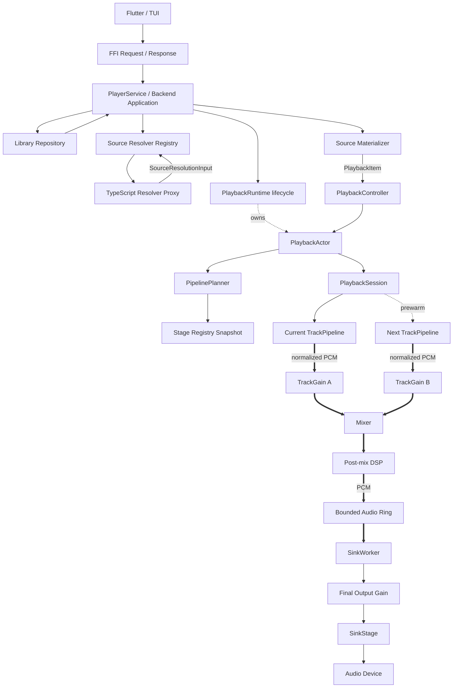

# Stellatune 播放核心重构设计

> 状态：Implemented / hard switch 已于 2026-09-02 完成
>
> 日期：2026-08-31
>
> 范围：播放核心边界、媒体源抽象、Decoder/Transform/Sink Trait、Pipeline 规划与执行、Library/插件/FFI 边界、迁移与验收
>

## 当前模块落位（2026-09-03）

本轮继续采用 hard switch，不保留旧 Rust 模块路径的 alias 或兼容性
`pub use`。`stellatune-audio::playback` 根模块只声明真实子模块：控制面位于
`control`、`event`、`runtime` 与 `actor`；曲目状态与准备位于 `state` 和
`preparation`；PCM 数据面位于 `pump`、`normalizer`、`transition` 与
`sink_worker`。公开调用方必须使用诸如
`playback::control::PlaybackController`、`playback::event::PlaybackEvent` 和
`playback::runtime::PlaybackRuntime` 的真实路径。

后端播放器按 `identity`、`source`、`state`、`catalog`、`resolver`、`service`
和 `error` 拆分。持久化由 `catalog::PlayerCatalog` 直接承担，source
materialization 归 `resolver`；不再提供只做代理的 `PlaybackStateStore` 或
`SourceMaterializer`。歌词 actor 状态、业务编排、provider、缓存和解析分别归
`lyrics_service/{actor,core,providers,cache,parser}.rs`。

所有 `apps/`、`crates/`、`tools/` 下的手写 Rust 文件以 1200 个物理行为硬
限制，约 900 行为软目标。通过
`cargo run -p stellatune-xtask -- check-loc` 验收；生成文件只允许显式白名单，
当前唯一例外为 `crates/stellatune-ffi/src/frb_generated.rs`。

`stellatune-audio-core` 同样采用真实模块路径，不提供根级 facade re-export：
PCM 类型归 `format`，播放值对象归 `playback`，媒体源契约归 `source`，共享
stage identity 归 `stage`，错误归 `error`，各 stage SPI 分别归
`decoder`、`transform` 和 `sink`。仓库调用方必须通过所属模块导入类型。
> 切换策略：Hard switch。新旧 API、token/typed 输入、新旧数据面和新旧播放器持久化 schema 均不兼容；不提供代码适配器、旧数据 migration、双读写、deprecated alias 或 feature flag。
>
> 关系：本文覆盖 `docs/plugin-runtime-refactor.md` 中与 `SourceStage`、`SourcePlan`、Pipeline 数据面相关的后续设计；Lattice、TypeScript 插件进程和 ASIO 许可边界仍沿用既有决策。

## 1. 结论

本次重构采用以下核心模型：

```text
TrackId（Application 中稳定的业务身份）
    |
    | 由 Backend/Application 解析
    v
PlaybackItem
    +-- PlaybackItemId（Core 只用于关联事件）
    `-- Arc<dyn SourceFactory>
              |
              | async open / prepare
              v
       Box<dyn EncodedSource>
              |
              v
       TrackPipeline(current) -- normalize -- TrackGain A --\
                                                          Mixer
       TrackPipeline(next) ---- normalize -- TrackGain B --/
                                                            |
                                                            v
                                             post-mix DSP / limiter
                                                            |
                                                            v
                                                 bounded PCM ring
                                                            |
                                                            v
                                      SinkWorker final gain -> Device
```

播放器核心负责“怎么播放”，不负责“曲目从哪里来”。

播放器核心拥有：

- 播放状态机；
- play、pause、stop、seek、queue-next 等动作语义；
- Pipeline 生命周期；
- block 调度、EOF、backpressure、gapless、预热和恢复策略；
- 播放时间线和 sink 消费位置；
- stage 选择规则与 DSP/output 顺序。

播放器核心不拥有：

- 曲库数据库和 SQL；
- `TrackId` 到本地路径、URL 或插件资源的解析；
- HTTP 鉴权和插件 RPC；
- Flutter/FFI request/response types 与 JSON protocol format；
- 具体文件、HTTP、decoder 和设备实现。

具体能力通过 Rust Trait 和 Factory 注入。Trait 是进程内接口，不是跨语言 ABI。

运行模型采用明确的边界：资源解析、连接和预加载允许异步；一旦进入 decoder/DSP/output pump，调用链使用同步、有界操作，不在音频热路径中 `.await`。网络 source 可以在内部运行异步 feeder，但 decoder 只从它暴露的有界缓冲同步读取。

Gapless、顺序淡化和 Crossfade 是三种不同能力：

- Gapless 提前准备下一曲，在边界复用输出链，不重叠也不改变增益；
- 顺序淡化只需要一条活动 TrackPipeline，执行 fade-out、切换、fade-in；
- 真正 Crossfade 必须让 current/next 两条 TrackPipeline 在一段时间内同时产出 PCM，在 Mixer 前分别应用 gain envelope。

## 2. 当前问题

### 2.1 `TrackToken(String)` 隐藏了跨层协议

当前播放输入表面上只有：

```rust
pub enum InputRef {
    TrackToken(String),
}
```

但字符串实际可能是：

- 本地路径；
- HTTP URL；
- 序列化后的 `TrackRef` JSON；
- 插件 resolver 处理后的 locator。

FFI、BackendAssembler、HybridDecoder 和事件转换分别解析这段字符串。编译依赖看似解耦，实际所有层共同依赖一个没有类型检查、没有版本约束的隐式 wire format。

Hard switch 完成后，`TrackToken` 及其 codec 在所有层同时删除。FFI/Application 不保留 token compatibility adapter，也不维护 token/typed 双入口。

### 2.2 当前 `SourceStage` 没有提供媒体数据

当前 `LocalSourceStage` 只进行：

```text
InputRef::TrackToken(String)
    -> SourceHandle::TrackToken(String)
```

随后 `HybridDecoderStage` 再解析字符串并自行打开文件或 URL。因此：

- Source 并不读取数据；
- Decoder 同时承担 locator 解析、I/O、格式选择和解码；
- File/HTTP source 的规划结果没有真正进入数据面；
- HTTP headers 等协商信息可能在转换中丢失；
- Source 和 Decoder 无法独立测试或替换。

目标状态下，Source 必须产出 encoded byte stream；Decoder 只消费 byte stream 并产出 PCM。

### 2.3 typed plan 与真实执行链是两条通路

当前 `SourcePlan` 已经描述 File/HTTP、headers、media hints 和 capabilities，但 source factory 忽略了 plan 中的 stage config，最终 decoder 仍从原始 token 获取 locator。

目标状态只能有一条事实来源：

```text
ResolvedSourceSpec
    -> SourceFactory
    -> EncodedSource
    -> DecoderStage
```

Plan 中已经选定或绑定的数据，不允许在下游重新从 token、JSON 或全局状态推导。

### 2.4 通用 Stage Hook 扩大了错误耦合

当前 `Stage` 基类和 `PipelineContext` 让所有 stage 都能看到播放位置和 pending seek，并通过 `refresh_runtime_state` 隐式同步状态。`TransformStage` 还包含 master gain、transition gain 和 gapless 的可选 setter。

这会产生几个问题：

- stage 可以依赖与自身无关的全局播放状态；
- seek 的实际执行者不明确；
- capability 通过默认返回 `false` 表达，错误容易拖到运行期；
- 新增一种 control 会扩大全部 transform 的公共接口；
- lifecycle 与数据处理混在一起。

目标状态不再存在万能 `Stage` Trait，也不把可变的共享 `PipelineContext` 传给每个 stage。

### 2.5 Crate 依赖方向被实现细节污染

当前存在两条不必要的依赖：

```text
stellatune-library
    -> stellatune-audio-builtin-adapters（源码未使用）

stellatune-audio-builtin-adapters
    -> stellatune-audio（只为复用 gapless helper）
```

它们让 Library 间接拉入播放器实现，也让 adapter 反向依赖运行时。

目标依赖方向必须满足：

```text
audio contracts <- player runtime
audio contracts <- builtin adapters

library ---------X player runtime
library ---------X audio adapters
```

## 3. 目标与非目标

### 3.1 目标

- Core 不接收路径、URL、数据库 ID JSON 或未经验证的插件 protocol input；
- Source、Decoder、Transform 和 Sink 能独立实现、替换和测试；
- Source 真正提供 encoded bytes；
- Decoder 不解析 locator，不发起插件 RPC，不读取数据库；
- Library 不依赖播放器和 audio adapters；
- HTTP headers、seek capability、live 属性等信息不会在跨层转换时丢失；
- Pipeline 只有一个强类型执行计划；
- PlaybackActor 是播放策略与状态的唯一所有者；
- PCM 和 encoded bytes 不经过 Actor mailbox、JSON-RPC 或 FFI；
- 慢协商和慢 open 不阻塞播放控制消息；
- decoder/DSP/output pump 不依赖 async runtime，不在逐 block 调用链中 `.await`；
- seek、短淡入淡出和 crossfade 都由音频帧驱动，不依赖 wall-clock timer/sleep；
- Gapless、顺序淡化和双 Pipeline Crossfade 有不同且可测试的语义；
- 结构变化重建 pipeline，参数变化通过明确的 typed control 更新；
- 实施阶段保持可验证；hard-switch changeset 只交付新架构，不为局部回滚保留旧类型、旧 schema 或双路径。

### 3.2 非目标

- 本次不设计稳定的第三方 Rust ABI；
- 不允许 TypeScript 直接传输 encoded bytes 或 PCM；
- 不让 Source 插件选择用户的 DSP、音量或输出设备；
- 不引入任意运行时 graph mutation；
- 不把所有内部 DSP 都强制改成 trait object；
- 不为旧内部类型和旧 FFI 播放入口提供兼容层；
- 不迁移或恢复旧播放器队列、进度、token、`source_id/track_id` 和旧 identity mapping；
- 不在本次重构中重新设计插件安装格式和 ASIO sidecar 协议；
- 不要求一步完成 crate 重命名和所有文件移动。

### 3.3 Hard switch 切换策略

本次重构不承担代码、协议或播放器持久化数据的兼容义务，采用一次性切换。架构干净优先于保留旧状态：

- 不同时保留 `switch_track_token` 和 `switch(PlaybackItem)`；
- 不保留 `InputRef::TrackToken` 到 `PlaybackItem` 的适配器；
- 不保留旧 `SourceStage` 与新 `SourceFactory` 两套可选数据面；
- 不增加 `legacy-player` feature flag；
- 不使用 deprecated wrapper 延后删除；
- 不让 Backend 根据输入格式选择旧链路或新链路；
- 不读取、转换或复制旧 playback queue/progress、字符串 TrackRef、token/locator 和旧 source mapping；
- 不实现 legacy schema detector + migrator，不保留 migration-only input/record type；
- Source Catalog、Track Catalog 和 PlaybackStateStore 只定义并打开新 schema；
- runtime 发现非当前 schema 时返回 `IncompatiblePlaybackSchema` 并拒绝启动播放器服务，不尝试猜测或修复旧数据；
- 切换版本前由开发/部署流程显式移除旧 player-owned storage，随后从空的新 schema 启动；
- 首次启动新版本时旧队列、当前曲目和播放进度不恢复，新的稳定 ID 从新 allocator 开始分配；
- Flutter API、FRB bindings、Backend、PlaybackRuntime/PlaybackController 和测试在同一个 hard-switch changeset 中更新；
- 编译错误用于暴露遗漏调用方，不通过兼容 shim 消除。

这里的删除范围是本次重构拥有或替换的 player state、Source/Track Catalog 和旧 token/identity 数据，不等于无条件删除未改变 schema 的 Library metadata、收藏、播放列表、歌词或插件安装数据。若其中某张现有表必须改成新 identity schema，则它也属于不兼容范围：通过重新扫描/重新同步建立新数据，不编写旧表到新表的转换器。

后文 Phase 只是重构分支中的实施顺序，不是数据 migration，也不代表生产代码支持双实现。发生 API/数据面/存储切换的阶段必须原子更新所有调用方、删除旧路径并使用全新的测试数据。若一个阶段无法在不引入兼容层的情况下独立合并，则继续在同一分支完成后续阶段再整体合并。

## 4. 架构原则与硬性约束

### 4.1 依赖倒置

Core 定义它需要的端口，外围提供实现：

```text
Core owns interfaces
Adapters implement interfaces
Backend wires implementations together
```

Core 不引用 `FileSource`、`HttpSource`、`SymphoniaDecoder`、`CpalSink` 或 `WasapiSink` 的具体类型。

### 4.2 业务身份和媒体位置分离

以下概念不能继续合并成一个字符串：

| 概念 | 归属 | 说明 |
|---|---|---|
| `SourceKind` | Application | 有限的来源类别，例如 LocalLibrary/Plugin；它是枚举，不是实例身份 |
| `SourceInstanceId` | Application/存储 | `u64` 来源实例身份，例如一个本地曲库或一个已配置插件账号 |
| `TrackId` | Application/FFI/存储 | `u64` 全局曲目身份，跨应用重启稳定 |
| `ProviderTrackKey` | Resolver/存储边界 | provider 原生 opaque key；必要时可以是字符串，但不进入播放 Core |
| `SourceResolutionInput` | 插件协议边界 | 未经信任的可序列化 resolver 输出 |
| `ResolvedSourceSpec` | Backend | 验证后的声明式结果，例如 typed File/HTTP spec |
| `PlaybackItemId` | Audio contract/Application | `u64` 持久化播放条目 ID，由 Application 分配、Core 透传 |
| `SourceFactory` | Audio contract | 已绑定配置、可重复打开的数据源工厂 |
| `EncodedSource` | Audio data plane | 实际可读取和可选 seek 的媒体字节流 |

`SourceKind` 和 `SourceInstanceId` 不能互相替代：前者回答“属于哪类 resolver”，后者回答“具体是哪一个已持久化来源”。同一 Plugin kind 可以存在多个 source instance。

Hard switch 后删除 `TrackRef { source_id: String, track_id: String }`。Flutter request types、FRB 生成代码和 Rust 播放入口只接收 `TrackId`，不保留旧字段或双格式反序列化。

这里禁止的是“用裸字符串表达身份、动作或多态 token”，不是禁止所有字符串。URL、MIME、HTTP header、插件 manifest ID 和部分 provider 原生 key 天然是文本；它们必须使用语义明确的 newtype/enum/input type，并停留在 Adapter/Resolver 边界，不能沿播放链路继续传播。

身份在播放入口逐层收敛：

```text
FFI/Application command
    TrackId(u64)
        -> TrackCatalogEntry
        -> SourceCatalogEntry + TrackOrigin
        -> resolver/materializer

Audio Core command
    PlaybackItem {
        id: PlaybackItemId(u64),
        source: Arc<dyn SourceFactory>,
        required_decoder: Option<Arc<dyn DecoderFactory>>,
    }
```

越过 `PlaybackController` 后不再存在 track/source/provider 字符串 identity。Core 看到的 MIME/extension 等字符串只是媒体提示，不是业务身份。

### 4.3 控制面和数据面分离

控制面与准备面可以异步、序列化和跨进程：

- library query；
- source resolution；
- 登录和 token refresh；
- plugin RPC；
- DNS/HTTP connect 和 source open；
- current/next pipeline 的 prepare/prewarm；
- capability/配置管理。

Source adapter 可以在内部使用 async I/O，但必须通过有界 encoded buffer 与 decoder 隔离：

```text
async HTTP/file feeder
    -> bounded encoded buffer
    -> EncodedSource::read / seek（同步、有界）
    -> DecoderStage::decode（同步）
```

实时数据面必须是 Rust/native、同步且有界：

- 从已经打开的 `EncodedSource` 读取 encoded bytes；
- decode；
- DSP；
- mix 和 gain envelope；
- PCM ring；
- device write。

这里的“同步”不等于允许无限阻塞。decoder 调用 source 时只能立即读到数据、得到 EOF/错误，或得到明确的暂不可用结果；它不能等待 DNS、认证刷新或远端网络请求。逐 block pump 中不持有 async future，也不把 `AsyncRead` 传入 decoder。

因此不是“开始解码后整个系统不能再有异步”，而是“异步工作只能在热路径之外并行准备数据，解码图本身不等待异步工作”。

### 4.4 Core 只保存必要状态

Core 可以保存：

- 当前 `PlaybackItemId`；
- 已绑定的 `SourceFactory`；
- 当前/下一条 pipeline；
- 播放状态、时间线、epoch；
- 输出策略和恢复 checkpoint。

Core 不保存：

- library row；
- title/artist/cover 等 UI metadata；
- source plugin 的 JSON input；
- HTTP bearer token 的日志可见形式；
- 数据库连接或 repository handle。

### 4.5 Stage 返回事实，Core 做策略决定

Stage 可以返回：

- EOF；
- 暂无输入；
- sink would-block；
- 是否支持 seek；
- 错误类别和 retry hint。

Stage 不决定：

- 是否自动切到下一曲；
- 是否 fallback 到其他 decoder；
- sink 断开后重试几次；
- 插件变化时是否恢复播放；
- seek 后丢弃哪些 generation 的 block。

这些属于 Core policy。

### 4.6 边界类型命名

目标架构不使用 `Dto`、`Model`、`Data` 或无语义的 `Payload` 作为通用后缀。类型名必须表达它的业务角色或验证状态：

| 名称形式 | 含义 | 示例 |
|---|---|---|
| 无后缀领域名 | 已验证、可在所属 domain 内使用 | `TrackId`、`ProviderTrackIdentity`、`MediaHints` |
| `Input` | 来自 FFI/plugin protocol，尚未验证 | `ProviderTrackIdentityInput`、`SourceResolutionInput` |
| `Request` | 一个明确的 command/query 请求 | `SwitchTrackRequest` |
| `Response` | 一个明确的边界返回结构 | `SearchTracksResponse` |
| `Spec` | 已验证的声明式构建输入 | `ResolvedSourceSpec` |
| `Descriptor` | immutable capability/selection facts | `SourceDescriptor`、`DecoderDescriptor` |
| `Record` | 持久化记录，不是领域服务对象 | `PlaybackQueueRecord` |
| `Snapshot` | 某一时刻的一致状态副本 | `PlaybackRuntimeSnapshot` |
| `Event` | 已发生事实 | `PlaybackEvent` |

优先使用模块路径表达边界，而不是把传输机制编码进每个类型名：

```text
ffi::SwitchTrackRequest
plugin_protocol::SourceResolutionInput
backend::ResolvedSourceSpec
stellatune_audio_core::source::MediaHints
storage::PlaybackQueueRecord
```

`Input -> domain type` 必须通过 `TryFrom` 或显式 validator；字段拷贝不等于验证。`Wire` 只允许用于确实需要固定字节/序列化布局的外部协议类型，不能作为 `Dto` 的替代词。

## 5. 目标分层



图中的关键边界：

- `PlayerService` 是 application orchestration，不属于音频 Core；
- `SourceResolver` 返回声明式、可序列化的结果；
- `SourceMaterializer` 将声明式结果绑定成 Rust `SourceFactory`；
- `PlaybackRuntime` 只负责 Actor/Worker 的启动、持有和关闭；
- `PlaybackController` 只接收已经可以播放的 `PlaybackItem`；
- `PipelinePlanner` 不解析路径或 JSON；
- `DecoderStage` 不知道 source 是文件、HTTP 还是 external proxy。
- 每个 `TrackPipeline` 内部拥有自己的 `EncodedSource -> Decoder -> pre-mix DSP -> normalizer`；
- `Next TrackPipeline` 默认只预热，只有 Crossfade 窗口才与 current 同时向 Mixer 产出 PCM；
- Mixer 前是每轨 transition gain，SinkWorker 中是面向最终输出的低延迟 gain，两者职责不同。

## 6. Crate 职责和依赖图

### 6.1 目标 crate 职责

```text
crates/stellatune-audio-core
  建议后续重命名 stellatune-audio-contracts
  - PcmFormat / AudioBlock / MediaTime
  - SourceFactory / EncodedSource
  - DecoderStage / TransformStage / SinkStage
  - Factory descriptors
  - 数据面错误类型
  - 不依赖 serde_json、sqlx、tokio runtime、插件 crate

crates/stellatune-audio
  - PlaybackRuntime / PlaybackController / PlaybackActor
  - PlaybackState / PlaybackSession
  - PipelinePlanner / StageRegistry snapshot
  - bounded pump、gapless、queue-next、recovery
  - Core-owned Mixer/Resampler/Gain DSP
  - SinkWorker 和 PCM ring

crates/audio-adapters/stellatune-audio-builtin-adapters
  - FileSourceFactory / HttpSourceFactory
  - SymphoniaDecoderFactory / NcmDecoderFactory
  - Playlist/HLS resolver 与 segmented source adapter
  - CPAL/WASAPI sink factories
  - 只依赖 audio contracts，不依赖 stellatune-audio

crates/stellatune-library
  - 数据库、扫描、收藏、播放列表和曲目 metadata
  - 不依赖 stellatune-audio 或 audio adapters

crates/stellatune-backend-api
  - PlayerService
  - TrackId/SourceInstanceId catalog resolution
  - SourceResolver registry
  - SourceResolutionInput validation
  - ResolvedSourceSpec -> SourceFactory materialization
  - 组装 StageRegistry 和 PlaybackRuntime
  - Library、插件、播放器之间唯一的 composition root

crates/stellatune-plugins
  - TypeScript manifest/package/process/protocol
  - source resolver、lyrics、auth 等控制面能力
  - 不依赖 PCM stage trait

crates/stellatune-ffi
  - Flutter request/response type 转换
  - 只调用 Backend facade
  - 不直接解析/驱动 audio pipeline 和插件 runtime
```

### 6.2 允许的依赖方向

```text
stellatune-audio-core
    ^             ^
    |             |
stellatune-audio  audio-builtin-adapters
    ^             ^
    |             |
    +------ stellatune-backend-api <------ stellatune-ffi
                    ^
                    |
          +---------+---------+
          |                   |
  stellatune-library   stellatune-plugins
```

禁止：

```text
stellatune-library -> stellatune-audio*
audio-builtin-adapters -> stellatune-audio
stellatune-audio-core -> backend/library/plugins/ffi
stellatune-audio -> backend/library/plugins/ffi
```

Library 若需要媒体 metadata probe，应使用独立的 leaf utility crate，或在 library 内定义 `MetadataExtractor` port 由 Backend 注入；不能因此依赖整个播放 adapter crate。

## 7. 核心领域模型

以下代码是目标 API 草案。重构时允许调整命名，但不能破坏它表达的边界。

### 7.1 播放身份

```rust
use std::num::NonZeroU64;

#[derive(Debug, Clone, Copy, PartialEq, Eq, Hash)]
pub struct SourceInstanceId(NonZeroU64);

#[derive(Debug, Clone, Copy, PartialEq, Eq, Hash)]
pub struct TrackId(NonZeroU64);

#[derive(Debug, Clone, Copy, PartialEq, Eq, Hash)]
pub struct PlaybackItemId(NonZeroU64);

#[derive(Debug, Clone, Copy, PartialEq, Eq, Hash)]
pub enum SourceKind {
    LocalLibrary,
    Plugin,
}
```

三个 ID 都是互不兼容的 opaque newtype，即使底层相同，也禁止相互比较或代换。它们由持久化层分配，Rust 中用 `NonZeroU64` 排除无效值；存储范围统一限制为：

```text
1 <= id <= i64::MAX as u64
```

这样可以无损保存为 SQLite `INTEGER`。allocator 必须持久化、检查溢出且不复用仍可能被引用的 ID。

Application 维护统一 Track Catalog：

```rust
pub struct SourceCatalogEntry {
    pub id: SourceInstanceId,
    pub binding: SourceBinding,
}

pub enum SourceBinding {
    LocalLibrary,
    Plugin { provider_id: ProviderId },
}

pub struct TrackCatalogEntry {
    pub id: TrackId,
    pub source: SourceInstanceId,
    pub origin: TrackOrigin,
}

pub enum TrackOrigin {
    LocalLibrary,
    Provider(ProviderTrackKey),
}

pub enum ProviderTrackKey {
    Numeric(u64),
    Text(String),
}

// String-backed newtype，只存在于存储/Resolver/插件协议边界。
pub struct ProviderId(String);
```

`SourceBinding` 避免 `SourceKind::LocalLibrary + Some(provider_id)` 之类无效组合；它可以通过 `kind()` 返回 `SourceKind` 供 resolver routing 使用。类别、binding 配置和 source instance identity 仍是三个不同概念。

Catalog 写入时还必须验证 `SourceBinding/TrackOrigin` 配对：LocalLibrary 只能对应 `TrackOrigin::LocalLibrary`，Plugin 只能对应 `TrackOrigin::Provider`。该约束由 typed repository API 和数据库 constraint 共同保证，不能把错误组合拖到播放时才发现。

`TrackId` 是播放命令使用的唯一业务曲目身份。`TrackCatalogEntry` 负责把它映射到 `SourceInstanceId + TrackOrigin`：本地曲目直接使用稳定 `TrackId` 查询 Library；远端来源保留 provider 自己的 numeric 或 text key。原生数字不能为了统一接口先转成字符串，只有 UUID/复合 ID 等天然文本身份才进入 `Text` 分支。

`ProviderTrackKey::Text` 仍需非空、长度上限和 provider-defined canonicalization 校验。Application 把校验后的 key 当 opaque value 做精确匹配，不在其中编码 path、URL、JSON 或认证信息，也不擅自做大小写归一化。

Track Catalog 是逻辑上的统一身份表，不要求复制全部曲目 metadata。本地 Library 现有主键只有在与远端条目共享同一全局 ID namespace 时才能直接作为 `TrackId`；否则 Catalog 分配独立 `TrackId`，再映射到 Library 内部主键。

来自远端搜索、推荐或临时浏览结果的曲目，在第一次 play/queue 前由 PlayerService `ensure_track` 写入 Track Catalog 并分配 `TrackId`。因此 Provider 原生字符串不会因为“尚未收藏到 Library”而泄漏进 Audio Core；加入播放会话和持久化队列不等于把曲目标记为用户收藏。

如果未来某类媒体明确不能进入 Catalog，例如一次性 live session，应定义独立的 typed application command 和生命周期，不退回通用字符串 token。

`PlaybackItemId` 的约束：

- 它表示一次队列/播放条目实例，不表示曲目本身；
- 同一 `TrackId` 连续加入队列两次，必须生成两个不同的 `PlaybackItemId`；
- ID 是持久化队列记录的一部分；只要该队列条目仍存在，跨应用重启保持不变；
- `PlaybackStateStore` 使用持久化、单调递增且检查溢出的 allocator 创建 ID；不能只使用每次启动归零的内存计数器；
- `0` 是无效值，存储/FFI 的 optional 状态使用 `Option<Id>`，不能用合法领域对象承载 0；
- Core 将数值视为 opaque value，不对它做业务解析或顺序推断；
- event、checkpoint、current/next 和异步结果使用它关联同一个播放条目；
- 它不编码 source ID、track ID 或 locator；它可以直接作为 playback queue 表主键，但不是 Library track 主键；
- Backend/Application 持久化 `PlaybackItemId -> TrackId` 关联，用于恢复 source 并查询 title、cover 等业务信息；
- 删除队列条目后 ID 不再有业务意义；历史记录若引用它，应保存自己的 `TrackId`，不能依赖活动队列表永久存在。

身份、类别和运行时版本必须分开：

| 类型 | 含义 | 生命周期 |
|---|---|---|
| `SourceKind` | 来源类别，不是 identity | 编译期有限枚举 |
| `SourceInstanceId(u64)` | 一个持久化来源实例 | source catalog entry 创建到删除/tombstone |
| `TrackId(u64)` | 全局业务曲目身份 | track catalog entry 创建后跨重启稳定 |
| `PlaybackItemId(u64)` | 一次持久化队列或播放实例 | 队列条目创建到删除，跨应用重启稳定 |
| session `generation` | 异步 prepare/rebuild 的版本 | 每次结构性操作递增 |
| PCM `epoch` | 输出 PCM 时间线版本 | seek、hard cut、discard/rebuild 等 discontinuity 时递增；连续 Gapless/Crossfade 不递增 |

`SourceKind` 只能用于选择 resolver 类别，不能作为 source identity。`ProviderId` 和 `ProviderTrackKey::Text` 即使底层是 `String`，也不能与 URL、path、JSON 或彼此互换。

### 7.2 媒体提示和能力

```rust
#[derive(Debug, Clone, Default, PartialEq, Eq)]
pub struct MediaHints {
    pub extension: Option<String>,
    pub mime_type: Option<String>,
    pub content_length: Option<u64>,
    pub container_hint: Option<String>,
}

#[derive(Debug, Clone, Copy, Default, PartialEq, Eq)]
pub struct SourceCapabilities {
    pub byte_seekable: bool,
    pub reopenable: bool,
    pub live: bool,
}

#[derive(Debug, Clone, PartialEq, Eq)]
pub struct SourceDescriptor {
    pub media: MediaHints,
    pub capabilities: SourceCapabilities,
}
```

`SourceDescriptor` 只描述 decoder/planner 需要的事实，不包含 path、URL、headers 或 provider JSON。

### 7.3 可播放条目

```rust
use std::sync::Arc;

pub struct PlaybackItem {
    pub id: PlaybackItemId,
    pub source: Arc<dyn SourceFactory>,
    pub required_decoder: Option<Arc<dyn DecoderFactory>>,
}
```

`PlaybackItem` 由 Backend 构造。`SourceFactory` 内部已经绑定路径、URL、headers、凭据或 external proxy 配置。

插件 manifest 或用户配置中的 decoder ID 可以是 string-backed `StageId`，但 Backend 必须先通过 Registry snapshot 把它解析成具体 `Arc<dyn DecoderFactory>`。`PlaybackController`、PlaybackActor 和数据面不再携带动态 decoder 名称并重复查表。

Core 可以 clone `Arc<dyn SourceFactory>`，从而支持：

- queue-next 预热；
- recover/reopen；
- pipeline rebuild；
- current track checkpoint。

### 7.4 音频格式和 block

```rust
#[repr(u8)]
pub enum SpeakerPosition {
    FrontLeft,
    FrontRight,
    FrontCenter,
    Lfe,
    RearLeft,
    RearRight,
    // ...标准位置一直到 TopRearRight
}

pub struct ChannelLayout(/* private positioned-speaker set */);

pub struct PcmFormat {
    pub sample_rate: u32,
    pub channel_layout: ChannelLayout,
}

#[derive(Debug, Clone, Copy, PartialEq, Eq)]
pub struct BlockTimeline {
    pub start_frame: u64,
    pub epoch: u64,
}

pub struct AudioBlock {
    pub format: PcmFormat,
    pub timeline: BlockTimeline,
    pub samples: Vec<f32>,
}
```

数据面固定使用 interleaved `f32` PCM。`AudioBlock` 必须满足：

- `ChannelLayout` 非空、位置不重复，最多支持 7.1.4 的 12 个位置型扬声器；声道数只能通过 `channel_count()` 从布局推导；
- interleaved 样本严格使用 `SpeakerPosition` 的 WAVEFORMATEXTENSIBLE canonical bit order；
- `samples.len()` 是 `channel_layout.channel_count()` 的整数倍；
- 同一 pipeline epoch 内 format 不会静默变化；
- seek、非连续切歌或输出结构重建会递增 epoch；无缝 promotion/Crossfade 保持同一 output epoch，并用 item boundary marker 表达曲目归属变化；
- 旧 epoch 的迟到 block 不得写入新 sink session；
- block 通过移动所有权或 buffer pool 复用，不能在每个 stage 无条件复制。

Core 不接受裸 `channel_mask`、只有数量的未知多声道、离散通道、Custom order 或 Ambisonics。Symphonia decoder 必须把 positioned layout 完整转换为 `ChannelLayout`；设备端必须报告精确扬声器布局。仅 mono/stereo 可以在底层没有位置元数据时安全推断，未知的多声道布局直接拒绝。

Core-owned normalizer 由 `ChannelMixer + PcmResampler` 组成。`ChannelMixer` 在 pipeline preparation 时构造一次位置型矩阵：相同位置直接复制；减少布局时中央、环绕、宽和高度声道以 `1/sqrt(2)` 为基础权重折叠到最近的有效位置；增加布局时只保留已存在位置，其余目标声道为静音。LFE 只在目标也有 LFE 时复制，不向普通扬声器折叠，也不由普通声道生成。每个输出矩阵行的绝对系数和超过 1 时整体归一化，避免满幅输入产生数学削波。

## 8. Source Trait

### 8.1 为什么 Source 不再叫普通 Stage

Decoder、Transform 和 Sink 都处理连续的数据流；Source 的职责是创建和持有 encoded resource。它的生命周期和错误模型与 PCM stage 不同，因此不需要继承一个通用 `Stage` Trait。

目标使用两个接口：

- `SourceFactory`：保存可重复打开的配置；
- `EncodedSource`：一次实际打开的 byte stream。

### 8.2 `EncodedSource`

```rust
use std::io::{Read, Seek};

pub trait EncodedSource: Read + Seek + Send {
    fn byte_len(&self) -> Option<u64>;

    fn is_seekable(&self) -> bool;
}
```

约束：

- local file 实现直接包装 `File`；
- HTTP source 在 adapter 内部使用 async feeder + bounded encoded buffer，对 decoder 暴露同步读取；
- HTTP range source 可以实现 seek；seek 到缓冲外时记录新逻辑位置、取消旧 range generation 并启动新 range 请求，后续 `read` 在数据未到达期间返回暂不可用，而不是阻塞 decoder；
- live/non-seekable source 的 `seek` 返回 `Unsupported`；
- `Read` 不允许无限阻塞：有数据则返回数据，结束则返回 EOF，暂时无数据则通过最终选定的 contract 表达 `WouldBlock/Pending`；
- encoded buffer 满时 feeder 必须 backpressure，空时 decoder 进入 buffering；不能使用无界缓存吸收网络或 decoder 速率差；
- Decoder/DSP 热路径不接收 `AsyncRead`，也不负责驱动 async runtime；
- 凭据由具体 source 实现持有，不出现在 Core 日志和 Debug 输出；
- Drop 必须能够可靠取消 feeder，并释放文件、response、sidecar resource 或 feeder task；
- source 的内部 I/O generation 与 playback epoch 分离，旧 range/request 的迟到数据不得进入新 seek 位置。

如果实践证明 `std::io::Read + Seek` 无法清晰表达 `Pending`，可以增加明确的 `read_chunk -> Data/Pending/Eof` 接口；在完成真实 HTTP 和 Symphonia spike 前，不同时维护两套读取 API。

### 8.3 `SourceFactory`

```rust
use std::future::Future;
use std::pin::Pin;

pub type SourceOpenFuture<'a> = Pin<
    Box<
        dyn Future<Output = Result<Box<dyn EncodedSource>, SourceError>>
            + Send
            + 'a,
    >,
>;

#[derive(Debug, Clone, Copy, PartialEq, Eq)]
pub enum SourceOpenPurpose {
    Initial,
    Prewarm,
    Recovery,
}

pub struct SourceOpenRequest {
    pub purpose: SourceOpenPurpose,
    pub deadline: Option<std::time::Instant>,
    pub cancellation: SourceCancellation,
}

pub trait SourceFactory: Send + Sync {
    fn descriptor(&self) -> SourceDescriptor;

    fn open(&self, request: SourceOpenRequest) -> SourceOpenFuture<'_>;
}
```

采用 async open、同步有界 read 的原因：

- DNS、连接、认证刷新和 sidecar 启动属于慢准备操作；
- 打开完成后的 decoder hot path 通常依赖同步拉取接口；
- PlaybackActor 可以用 deferred completion + generation guard 等待 open，而不阻塞控制消息；
- drop open future 即取消尚未完成的准备。

`SourceFactory::open` 的 future 结束，只表示 source 已经建立到足以交给 decoder；不要求整个媒体文件已经下载。后续异步预取由返回的 `EncodedSource` 实现自行管理，并通过 bounded buffer 向 decoder 暴露数据。

实现示例：

```text
FileSourceFactory
  captures PathBuf
  open -> FileEncodedSource

HttpSourceFactory
  captures URL + redacted headers + retry policy
  open -> BufferedHttpEncodedSource

ExternalSourceFactory
  captures provider/resource ID
  open -> ExternalEncodedSourceProxy

MemorySourceFactory
  captures Arc<[u8]>
  open -> CursorEncodedSource
  用于单元测试
```

## 9. Decoder Trait

### 9.1 Decoder 的唯一职责

Decoder 将一个已经打开的 `EncodedSource` 转成 PCM。它不知道源对应哪个数据库、路径、URL 或插件。

```rust
#[derive(Debug, Clone, PartialEq, Eq)]
pub struct DecodedStreamInfo {
    pub format: PcmFormat,
    pub duration_frames: Option<u64>,
    pub gapless_trim: Option<GaplessTrimSpec>,
}

#[derive(Debug, Clone, Copy, PartialEq, Eq)]
pub enum DecodeStatus {
    Produced { frames: usize },
    Pending,
    EndOfStream,
}

#[derive(Debug, Clone, Copy, PartialEq, Eq)]
pub struct SeekResult {
    pub actual_frame: u64,
}

#[derive(Debug, Clone, Copy, PartialEq, Eq)]
pub enum DecoderSeekStatus {
    Pending,
    Complete(SeekResult),
}

pub trait DecoderStage: Send {
    fn open(
        &mut self,
        source: Box<dyn EncodedSource>,
        hints: &MediaHints,
    ) -> Result<DecodedStreamInfo, DecodeError>;

    fn decode(&mut self, output: &mut AudioBlock)
        -> Result<DecodeStatus, DecodeError>;

    fn start_seek(&mut self, target_frame: u64)
        -> Result<DecoderSeekStatus, DecodeError>;

    fn continue_seek(&mut self)
        -> Result<DecoderSeekStatus, DecodeError>;

    fn reset(&mut self);
}
```

约束：

- `open` 后 Decoder 独占 `EncodedSource`；
- `decode` 不修改播放器的全局 position；
- `start_seek` 每个 seek transaction 只调用一次；返回 `Pending` 后由 Core 在后续 bounded turn 调用 `continue_seek`；
- seek 状态机只改变 decoder/source 内部位置，ring discard、epoch 和 sink clock 由 Core 管理；
- 新 seek、stop 或 teardown 必须能通过 `reset`/drop 取消未完成 seek；
- `Pending` 表示上游暂时无数据，不等于 EOF；
- decoder 不执行 fallback；fallback 由 planner/prepare policy 决定；
- decoder 不返回 UI metadata；播放 metadata 属于 Library/Application；
- duration、format 和 gapless 是解码/时间线事实，可以返回给 Core。

### 9.2 Decoder Factory

```rust
pub struct DecoderDescriptor {
    pub id: StageId,
    pub priority: i32,
    pub extensions: Vec<String>,
    pub mime_types: Vec<String>,
}

pub trait DecoderFactory: Send + Sync {
    fn descriptor(&self) -> &DecoderDescriptor;

    fn create(&self) -> Result<Box<dyn DecoderStage>, FactoryError>;
}
```

当前 `HybridDecoderStage` 应拆成多个独立 factory：

```text
SymphoniaDecoderFactory
NcmDecoderFactory
ExternalDecoderFactory（需要时）
```

候选评分和 fallback 在 `PipelinePlanner`/prepare 阶段执行一次，不在一个“混合 decoder”内部再次解析路径并选择实现。

M3U/M3U8/HLS 是资源编排或分段传输格式，不是音频 codec。目标架构中它们应由 resolver/segmented source 处理，再把实际媒体 byte stream 交给普通 decoder；不能继续因为文件扩展名而伪装成 `PlaylistDecoderStage`。如果 HLS demux 确实需要专用 native 实现，也应建模为明确的 segmented source/container adapter，而不是让通用 decoder 重新承担 locator 解析。

## 10. Transform Trait

### 10.1 最小数据面接口

```rust
#[derive(Debug, Clone, Copy, PartialEq, Eq)]
pub enum TransformStatus {
    Produced,
    Buffered,
}

#[derive(Debug, Clone, Copy, PartialEq, Eq)]
pub enum DrainStatus {
    Produced,
    Complete,
}

pub trait TransformStage: Send {
    fn configure(&mut self, input: PcmFormat)
        -> Result<PcmFormat, TransformError>;

    fn process(&mut self, block: &mut AudioBlock)
        -> Result<TransformStatus, TransformError>;

    fn drain(&mut self, output: &mut AudioBlock)
        -> Result<DrainStatus, TransformError>;

    fn reset(&mut self);
}
```

第一版约束每次 `process` 最多产出一个 block：

- 原地 transform 修改传入 block；
- 需要缓存输入时清空 block 并返回 `Buffered`；
- EOF 后 Core 重复调用 `drain`，直到 `Complete`；
- 如果未来存在稳定的一入多出需求，再引入有界 `BlockOutput`，不提前暴露无界 `Vec<AudioBlock>`。

### 10.2 不再把所有 control 塞入 Transform Trait

以下接口不再属于每个 transform：

```text
set_master_gain
set_transition_gain
set_gapless_trim
refresh_runtime_state
```

Core-owned DSP 优先使用具体类型和显式控制句柄：

```rust
pub struct PipelineControls {
    pub current_track_gain: Option<TrackGainHandle>,
    pub next_track_gain: Option<TrackGainHandle>,
    pub final_output_gain: Option<OutputGainHandle>,
}
```

例如：

```rust
pub trait OutputGainControl: Send + Sync {
    fn set_gain(&self, request: GainRequest) -> Result<(), ControlError>;
}
```

三个 gain 的位置和职责不能混用：

| Gain | 位置 | 职责 |
|---|---|---|
| `TrackGain A/B` | 每条 TrackPipeline 末尾、Mixer 之前 | Crossfade 中独立控制两首曲目的包络 |
| `FinalOutputGain` | Mixer/PostDSP 之后，优先在 SinkWorker 消费 PCM 时应用 | master volume、pause/stop/seek/manual switch 的低延迟短 ramp 和 de-click |

Crossfade gain 如果放在 Mixer 后，只能同时改变两首曲目的总音量，无法让 A 降、B 升。最终输出 gain 靠近 Sink 是为了不让已经排入 PCM ring 的数据放大交互控制延迟。

所有 ramp/envelope 都按实际处理或消费的 audio frame 推进：

```rust
pub struct GainEnvelope {
    pub start_gain: f32,
    pub end_gain: f32,
    pub duration_frames: u64,
    pub curve: GainCurve,
}
```

不得使用 `sleep(duration)` 或普通 wall-clock timer 驱动淡入淡出；pause、underrun 和设备时钟变化不能让包络跳帧。

结构能力和热控制分开：

| 变化 | 处理方式 |
|---|---|
| 音量、短 ramp | typed hot control |
| seek | PlaybackSession 显式流程 |
| 切换 decoder | 重建 TrackPipeline |
| Crossfade | 同时驱动两条 TrackPipeline + 每轨 envelope + Mixer |
| 插入/移除 transform | 安全边界重建 |
| 修改输出设备/backend | 重建 OutputPipeline |
| 插件启停 | checkpoint 后完整重建 |

### 10.3 Transform Factory

```rust
pub struct TransformDescriptor {
    pub id: StageId,
    pub placement: TransformPlacement,
}

pub trait TransformFactory: Send + Sync {
    fn descriptor(&self) -> &TransformDescriptor;

    fn create(&self) -> Result<Box<dyn TransformStage>, FactoryError>;
}
```

Provider-specific JSON 配置必须在 Backend/注册阶段完成校验，并绑定进 factory。`stellatune-audio-core` 和热路径不接收 `serde_json::Value`。

## 11. Sink Trait

### 11.1 Sink 数据面接口

```rust
#[derive(Debug, Clone, Copy, PartialEq, Eq)]
pub enum SinkWriteState {
    Ready,
    WouldBlock,
}

#[derive(Debug, Clone, Copy, PartialEq, Eq)]
pub struct SinkWriteResult {
    pub consumed_frames: usize,
    pub state: SinkWriteState,
}

#[derive(Debug, Clone, Copy, PartialEq, Eq)]
pub struct SinkClockSnapshot {
    pub consumed_frames: u64,
    pub buffered_frames: u64,
    pub epoch: u64,
}

pub trait SinkStage: Send {
    fn open(&mut self, format: PcmFormat) -> Result<(), SinkError>;

    fn write(&mut self, block: &AudioBlock)
        -> Result<SinkWriteResult, SinkError>;

    fn pause(&mut self) -> Result<(), SinkError>;

    fn resume(&mut self) -> Result<(), SinkError>;

    fn drain(&mut self) -> Result<(), SinkError>;

    fn discard(&mut self) -> Result<(), SinkError>;

    fn clock_snapshot(&self) -> SinkClockSnapshot;

    fn close(&mut self);
}
```

约束：

- sink instance 只由 `SinkWorker` 所在线程调用；
- Core 不直接持有设备 callback 对象；
- partial write 必须显式返回 consumed frames；
- `WouldBlock` 不能转换成无界缓存；
- 播放位置以 sink 实际 consumed frames 为准，不以 decoder 读取位置为准；
- `discard` 用于 seek/stop，不能误报为已播放；
- `drain` 用于自然 EOF 或显式 drain policy。

`SinkStage` 只表达设备能力，不加入 fade/crossfade API。低延迟 final output gain 和 consumed-frame barrier 由 Core-owned `SinkWorker` 包装：

```rust
pub enum SinkWorkerCommand {
    SetOutputGain(GainRequest),
    ScheduleEnvelope(GainEnvelope),
    InsertItemBoundary {
        item_id: PlaybackItemId,
        marker_id: SinkMarkerId,
    },
    Discard {
        epoch: u64,
    },
}
```

Worker 在消费 PCM frame 时应用 envelope；到达 envelope 末帧或 item marker 后，向 PlaybackActor 返回 typed completion。Actor 仍是唯一发布 `TrackChanged`、完成 seek/switch 事务和改变 PlaybackState 的策略所有者。

### 11.2 Sink Factory 和兼容键

```rust
#[derive(Debug, Clone, PartialEq, Eq, Hash)]
pub struct OutputCompatibilityKey {
    pub backend_id: String,
    pub device_id: Option<String>,
    pub sample_rate: u32,
    pub channel_layout: ChannelLayout,
    pub route_revision: u64,
}

pub trait SinkFactory: Send + Sync {
    fn id(&self) -> &StageId;

    fn compatibility_key(
        &self,
        format: PcmFormat,
    ) -> Result<OutputCompatibilityKey, FactoryError>;

    fn create(&self) -> Result<Box<dyn SinkStage>, FactoryError>;
}
```

下一曲能否复用 output 只比较强类型兼容键，不依赖全局变量或对配置 JSON 做 hash。

Windows Shared 和 WASAPI Exclusive 从 endpoint mix format 的 `dwChannelMask` 得到布局；Exclusive 打开时必须把同一个精确 mask 写入 `WaveFormat`，不能接受驱动替换成另一种同声道数布局。非 Windows CPAL 若只能提供声道数，则只接受 mono/stereo，多声道返回 unsupported-layout。

`route_revision` 表示设备路由配置的修订号，不是 playback session generation；普通切歌不能因为 session generation 变化而失去 output 复用能力。

## 12. 不再保留通用 `Stage` 和共享 `PipelineContext`

目标删除：

```rust
pub trait Stage {
    fn key(&self) -> &str;
    fn refresh_runtime_state(&mut self, ctx: &mut PipelineContext);
}
```

替代规则：

- identity 属于 factory descriptor；
- seek 由 PlaybackSession 驱动 `DecoderStage::start_seek/continue_seek` 状态机；
- position 由 `PlaybackTimeline` 和 sink clock 管理；
- volume 等热更新走 typed control handle；
- reset/drain/open 由各自 Trait 明确声明；
- 只有真正需要播放时间线的 DSP 才接收窄化的 `ProcessContext`。

如果某类 DSP 需要时间线，可以使用只读上下文：

```rust
#[derive(Debug, Clone, Copy)]
pub struct ProcessContext {
    pub epoch: u64,
    pub block_start_frame: u64,
}
```

它不包含 pending command，也不能被 stage 用来修改播放器状态。

## 13. Registry、Planner 和可执行计划

### 13.1 Registry 只保存描述符和 Factory

```text
StageRegistrySnapshot
  +-- DecoderFactory[]
  +-- TransformFactory[]
  `-- SinkFactory[]
```

Registry 不保存：

- 活动 stage instance；
- 当前播放状态；
- track token；
- provider JSON；
- source credentials；
- mutable graph。

插件/设备配置变化产生新的 immutable snapshot。旧 snapshot 在活动 session teardown 后释放。

### 13.2 播放请求

```rust
pub struct PlaybackRequest {
    pub item: PlaybackItem,
    pub output: OutputSelection,
    pub policies: PlaybackPolicies,
}
```

`PlaybackRequest` 与 autoplay 分离。autoplay 是 switch command 的动作参数，不是媒体计划的一部分。

### 13.3 可执行计划

```rust
pub struct ExecutablePlaybackPlan {
    pub item: PlaybackItem,
    pub decoder_candidates: Vec<std::sync::Arc<dyn DecoderFactory>>,
    pub transforms: Vec<std::sync::Arc<dyn TransformFactory>>,
    pub sink: std::sync::Arc<dyn SinkFactory>,
    pub policies: PlaybackPolicies,
}
```

`PipelinePlanner` 负责：

1. 读取 `SourceDescriptor.media`；
2. 若 `required_decoder` 已由 Backend 绑定，验证它与 source/media capabilities 兼容；
3. 否则按 extension/MIME/priority 生成有序 decoder candidates；
4. 为每条 TrackPipeline 按固定顺序构造 gapless trim、用户 pre-mix transform、mix-format normalizer 和 track gain；
5. 构造共享的 Mixer、用户 post-mix transform、limiter/final output gain 和 bounded PCM ring；
6. 选择已由用户配置绑定的 sink factory；
7. 生成 immutable `ExecutablePlaybackPlan`。

Planner 规划的是能力和固定拓扑，不预先创建两条活动 Pipeline。普通播放和 Gapless 可以只有一条正在产出 PCM 的 TrackPipeline；只有 transition policy 选择 Crossfade 且 next 已经 ready 时，PlaybackSession 才同时激活 current/next 两条 TrackPipeline。

Planner 不执行：

- source plugin RPC；
- path/URL 判断；
- JSON schema validation；
- 文件或 HTTP open；
- stage instance 生命周期操作。

### 13.4 准备阶段允许 decoder fallback，运行期不隐式切换

Planner 可以输出有序 decoder candidates，prepare 按顺序尝试：

```text
candidate.create
    -> source.open
    -> decoder.open
```

注意 source 可能需要为下一个 candidate 重新打开，因此 `SourceCapabilities.reopenable` 必须参与 fallback policy。

一旦进入 Playing：

- 不在热路径静默替换 decoder；
- decoder fatal error 进入明确 recovery/failed 流程；
- 所有 fallback 都记录 candidate、错误分类和最终选择。

## 14. Backend 的 Source Resolution

### 14.1 FFI 输入

播放入口只接收稳定 `TrackId`：

```rust
pub struct SwitchTrackRequest {
    pub track_id: TrackId,
    pub options: SwitchOptions,
}
```

这是 breaking change。`TrackRef { source_id: String, track_id: String }`、locator 字段、token encoder/decoder 和对应 FFI 入口在同一个 hard-switch changeset 中删除。

Flutter/FRB native request type 使用 `u64`/typed wrapper。若未来某个 JSON/Web transport 无法无损承载 64 位整数，可以在线格式中把它编码为 decimal string，但必须在最外层 request conversion 立即严格解析成 `TrackId`；protocol representation 不改变领域模型，也不能因此让 Core 接受任意字符串。

远端搜索结果尚未进入 Track Catalog 时，使用明确标记“尚未验证”的输入类型：

```rust
pub struct ProviderTrackIdentityInput {
    pub source_instance_id: u64,
    pub provider_key: ProviderTrackKeyInput,
}

pub enum ProviderTrackKeyInput {
    Numeric(u64),
    Text(String),
}

pub struct ProviderTrackIdentity {
    pub source_instance_id: SourceInstanceId,
    pub provider_key: ProviderTrackKey,
}

impl TryFrom<ProviderTrackIdentityInput> for ProviderTrackIdentity {
    type Error = ProviderTrackIdentityError;

    fn try_from(input: ProviderTrackIdentityInput)
        -> Result<Self, Self::Error>
    {
        Ok(Self {
            source_instance_id: SourceInstanceId::try_from(
                input.source_instance_id,
            )?,
            provider_key: ProviderTrackKey::try_from(
                input.provider_key,
            )?,
        })
    }
}
```

用户触发 play/queue 时，PlayerService 先将 `ProviderTrackIdentityInput` 转换成验证后的 `ProviderTrackIdentity`，再通过 `ensure_track` 原子查找或创建 `TrackCatalogEntry`。两种类型都不是 Audio Core API，也不允许被序列化成通用播放 token。

### 14.2 声明式解析结果

插件协议接收未验证的 `SourceResolutionInput`：

```rust
pub struct MediaHintsInput {
    pub extension: Option<String>,
    pub mime_type: Option<String>,
    pub content_length: Option<u64>,
    pub container_hint: Option<String>,
}

pub enum SourceResolutionInput {
    File {
        path: String,
        media: MediaHintsInput,
    },
    Http {
        url: String,
        headers: std::collections::BTreeMap<String, String>,
        media: MediaHintsInput,
        live: bool,
    },
    External {
        provider_id: String,
        resource: serde_json::Value,
        media: MediaHintsInput,
    },
}
```

`Input` 后缀表示值来自 FFI/plugin protocol，尚未满足领域 invariant。这里允许 String/JSON，因为它仍处于非实时控制面，但它不能从 Backend resolver port 原样返回。

TypeScript proxy 或其他 external resolver adapter 在边界完成验证，产出 Backend-owned `ResolvedSourceSpec`：

```rust
pub enum ResolvedSourceSpec {
    File {
        path: std::path::PathBuf,
        media: MediaHints,
    },
    Http {
        url: url::Url,
        headers: ValidatedHttpHeaders,
        media: MediaHints,
        live: bool,
    },
    External {
        provider_id: ProviderId,
        resource: ValidatedProviderResource,
        media: MediaHints,
    },
}
```

Backend 的 `SourceResolver` port 只返回 `ResolvedSourceSpec`。因此本地 Rust resolver 可以直接构造领域结果，TypeScript proxy 则必须先完成 `SourceResolutionInput -> ResolvedSourceSpec` 转换。

### 14.3 Validation 与 Materialization

```text
SourceResolutionInput
    -> validate
    -> ResolvedSourceSpec

ResolvedSourceSpec::File
    -> Arc<FileSourceFactory>

ResolvedSourceSpec::Http
    -> Arc<HttpSourceFactory>

ResolvedSourceSpec::External
    -> Arc<ExternalSourceFactory>
```

边界 validator 负责：

- URL scheme、header、path 和 provider schema 校验；
- `MediaHintsInput -> MediaHints` 转换；
- 将裸 provider/stage identity 转换为 newtype 或 registry binding；
- 限制 String/JSON 大小，并拒绝把 locator/token 藏入 identity 字段。

Materializer 负责：

- 将敏感字段绑定进具体 factory；
- 将验证后的 provider-specific resource 绑定进 adapter，不把 JSON 传给 Core；
- 将已经解析的 registry binding 固化为具体 factory；
- 使用 `PlaybackStateStore` 已分配的 `PlaybackItemId` 构造 `PlaybackItem`。

### 14.4 本地 Library 流程

```text
Flutter TrackId(42)
    -> PlayerService
    -> TrackCatalog::get(TrackId(42))
    -> TrackCatalogEntry {
           source: SourceInstanceId(1),
           origin: TrackOrigin::LocalLibrary,
       }
    -> SourceCatalog::get(SourceInstanceId(1))
    -> SourceBinding::LocalLibrary
    -> LibraryRepository::resolve_track(TrackId(42))
    -> LocalTrack { path, extension, ... }
    -> ResolvedSourceSpec::File
    -> FileSourceFactory
    -> PlaybackItem
    -> PlaybackController::switch
```

播放器 Core 永远不会访问 LibraryRepository。

### 14.5 TypeScript Source 流程

```text
Flutter TrackId(9001)
    -> PlayerService
    -> TrackCatalogEntry {
           source: SourceInstanceId(7),
           origin: TrackOrigin::Provider(
               ProviderTrackKey::Text("...")
           ),
       }
    -> SourceCatalogEntry {
           binding: SourceBinding::Plugin {
               provider_id: ProviderId("netease"),
           },
    }
    -> TypeScriptSourceResolverProxy
    -> SourceResolutionInput::Http
    -> validate
    -> ResolvedSourceSpec::Http
    -> materialize HttpSourceFactory
    -> PlaybackItem
    -> PlaybackController::switch
```

TypeScript 只返回 URL、headers 和提示；媒体 bytes 直接进入 Rust HTTP source，不经过 Node。

## 15. 从 switch 到播放的完整流程

### 15.1 Resolve

1. UI 调用 `switch_track(track_id, options)`；
2. FFI 只做 request conversion 和最外层输入校验；
3. `PlayerService` 用 `TrackId` 查询 Track Catalog，再用 `SourceInstanceId` 查询 Source Catalog；
4. `PlayerService` 根据 typed `SourceKind/TrackOrigin` 选择 local repository 或 plugin resolver，并只在该边界取出 `ProviderTrackKey`；
5. plugin proxy 将 `SourceResolutionInput` 验证成 `ResolvedSourceSpec`；本地 resolver 直接构造 `ResolvedSourceSpec`；
6. Backend `SourceResolver` port 只返回 `ResolvedSourceSpec`；
7. materializer 生成 `PlaybackItem`；
8. resolve/validation 失败时，当前曲目继续播放，错误返回 UI，Core 不进入 Preparing。

### 15.2 Plan

1. `PlaybackController::switch(item, options)` 向 PlaybackActor 发送 typed request；
2. Actor 增加 session generation；
3. Actor 进入 `Preparing`，保留或停止旧 session 的行为由明确 switch policy 决定；
4. Planner 使用 registry snapshot 生成 executable plan；
5. plan 只包含 factory 和 typed policy。

### 15.3 Prepare

1. 在可取消的 preparation task 中创建第一个 decoder candidate；
2. 为该 candidate 调用 `SourceFactory::open`；
3. `DecoderStage::open(encoded_source, hints)` 得到原始 `PcmFormat`；
4. 若 candidate 在 open 阶段失败且 policy 允许 fallback，为下一个 candidate 重新打开 source；
5. 选定 decoder 后依次 configure per-track transform 和 mix-format normalizer，使所有活动 TrackPipeline 输出相同 sample rate、channel layout 和 sample format；
6. configure 共享的 Mixer 和 post-mix/output chain；
7. 计算 sink compatibility key；
8. 创建或复用 SinkWorker session；
9. preparation completion 带 generation 回到 PlaybackActor；
10. generation 已过期则立即 drop 完整结果，不影响新 session。

### 15.4 Pump

普通播放时，单次 bounded pump 只驱动 current：

```text
decoder.decode
    -> gapless trim
    -> user pre-mix transforms
    -> mix-format normalizer
    -> current track gain
    -> mixer（单输入）
    -> user post-mix transforms
    -> bounded PCM ring
    -> SinkWorker final output gain
```

Crossfade 窗口中，current 和 next 各自在独立的有界 turn 中产出同一种 mix format：

```text
current decoder -> trim -> pre-mix DSP -> normalize -> TrackGain A --\
                                                                    Mixer
next decoder ----> trim -> pre-mix DSP -> normalize -> TrackGain B --/
                                                                      |
                                                            post-mix DSP
                                                                      |
                                                               PCM ring
                                                                      |
                                                    SinkWorker final gain
```

Mixer 必须以同一个音频时间轴对齐两路 block。任一路暂时 `Pending` 时，transition policy 决定延后 Crossfade、在尚未开始时降级，或在已经开始后报告 buffering；不能在 pump 内等待网络 future。

每个 actor turn 同时受两种预算约束：

- 最多处理 N 个 block；
- 最多占用 T 微秒。

达到任一预算后 yield，让 play/pause/seek/stop 等控制消息得到调度。

整个 pump 是同步状态机：一次调用只消费当前已经可用的数据并在预算边界返回；所有异步 source/prewarm completion 都通过消息在下一次 actor turn 生效。

### 15.5 Position

```text
decoded frames != played frames
queued frames  != played frames
sink consumed frames == authoritative playback position
```

Core 使用：

```text
track base position
    + sink consumed frames in current epoch
    -> public position
```

decoder 的 frame cursor 只用于解码和 seek，不直接作为 UI position。

## 16. Seek 流程

Seek 必须是一个由 PlaybackSession 编排的显式事务，不是 Source/Transform 被动观察到的一项全局状态。

默认使用 flushing seek：

1. 验证当前 decoder/source 是否支持 seek；
2. 合并连续 seek 请求，只保留尚未执行请求中的最新目标；
3. 暂停向 PCM ring 生产；
4. 要求 SinkWorker discard 已排队 PCM；
5. 增加 playback epoch，并使旧 source range generation 失效；
6. reset decoder 之后的所有 stateful transforms、Mixer 输入状态和 pending block；
7. 调用 `DecoderStage::start_seek(target_frame)`；如果返回 `Pending`，在后续 bounded turn 中调用 `continue_seek`，期间 Actor 仍处理新 seek/stop/switch；
8. 状态机 `Complete` 后记录 decoder 返回的 `actual_frame`；accurate seek 需要时从较早 keyframe 解码并丢弃到目标位置；
9. reset sink clock base；
10. preroll/预填充少量新 epoch PCM；
11. 从 0 到目标增益执行一个很短、按 frame 推进的 de-click fade-in；
12. 根据 seek 前状态恢复 Playing 或 Paused；
13. 拒绝所有旧 epoch/source generation 的迟到数据和事件。

`actual_frame` 是 decoder 能保证的新时间线起点。Core 对外位置从它加上 sink consumed frames 计算，不能先报告请求目标再让真实音频从另一个位置开始。

可选的 smooth seek 在第 3 步前先向 SinkWorker 安排短 fade-out，并等待该 envelope 被设备实际消费，再 discard、seek 和 fade-in。该模式听感更柔和但会增加 seek 完成延迟；拖动进度条和连续 scrubbing 默认使用 flushing seek，只在最终落点做一次短 fade-in。

Seek 与正在进行的 Crossfade 冲突时，默认取消 transition、丢弃 next 的混音状态，并只对 current item 执行 seek。跨曲目时间线 seek 属于 Queue/Application 策略，不能暗中解释为对 current decoder 的 seek。

Seek 不再通过 `PipelineContext.pending_seek_ms` 被 stage 被动观察，也不通过 async sleep 等待淡化完成；完成条件来自 SinkWorker 消费的 frame/envelope barrier。

## 17. Queue-next、预热与曲目过渡

### 17.1 Queue-next 输入已经完成 resolve

`queue_next` 接收 `PlaybackItem`，不是 token。PlayerService 可以在当前曲播放期间提前完成远端 source resolution。

### 17.2 预热边界

预热允许：

- source open；
- decoder create/open；
- format probe；
- decoder 内部小规模预读。

预热不允许：

- 提前写入当前 sink epoch；
- 修改当前 track 的 transform state；
- 持有无界 encoded/PCM 缓冲；
- 把下一曲的错误覆盖为当前曲错误。

### 17.3 三种 transition 语义

Gapless、顺序淡化和 Crossfade 必须是不同的 policy，不能复用一个含义模糊的 `transition_gain` 开关：

```rust
pub enum TrackTransitionPolicy {
    Gapless,
    FadeOutIn {
        fade_out_frames: u64,
        fade_in_frames: u64,
        curve: GainCurve,
    },
    Crossfade {
        duration_frames: u64,
        curve: CrossfadeCurve,
        fallback: CrossfadeFallback,
    },
}

pub enum CrossfadeFallback {
    Gapless,
    FadeOutIn,
}
```

用户手动立即切歌和自然播放到曲尾可以使用不同 policy。Crossfade 的时长进入执行层时转换成 mix-format frames；配置/FFI 可以继续使用毫秒。

### 17.4 Gapless promotion

Gapless 不做 fade，也不让两首歌重叠。自然 EOF 时：

1. drain current decoder/transform 的有效尾部；
2. 根据 gapless trim 丢弃 current encoder padding，并跳过 next encoder delay；
3. 确认 next TrackPipeline 已 ready；
4. 比较 next output compatibility key；
5. compatible 时复用 Mixer/OutputPipeline/SinkWorker，并在无静音间隙的 frame 边界 promote；
6. incompatible 时在边界重建 output；该场景不能宣称严格 gapless；
7. 在无缝边界切换 current item，并使旧 preparation generation 失效；连续 output epoch 不递增；
8. item boundary marker 随 PCM 到达 SinkWorker；marker 被消费后由 PlaybackActor 发布且只发布一次 `TrackChanged(next.id)`；
9. sink clock 的 item base 在 marker 被实际消费时切换，设备时钟保持连续。

Gapless 的正确性主要来自 next 预热、codec delay/padding 处理和输出设备复用，不来自淡入淡出。

### 17.5 顺序淡化

顺序淡化只需要一条正在解码的 TrackPipeline：

```text
current final-output fade-out
    -> 等待 SinkWorker consumed-frame barrier
    -> discard 未消费的旧 PCM
    -> teardown/promote next
    -> preroll
    -> next final-output fade-in
```

它适合手动切歌、stop 和不支持双 Pipeline 的输出环境。fade-out 完成的依据是设备实际消费到 envelope 末帧，而不是“Core 已经把带 fade 的 PCM 写进 ring”。

### 17.6 真正 Crossfade

Crossfade 在重叠窗口内同时驱动 current 和 next：

```text
TrackPipeline A -> mix-format normalize -> GainEnvelope A (1 -> 0) --\
                                                                         Mixer
TrackPipeline B -> mix-format normalize -> GainEnvelope B (0 -> 1) --/
```

硬性约束：

- 两条 TrackPipeline 各自拥有 Source、Decoder、gapless trim、pre-mix transform 和 track gain；
- 两路进入 Mixer 前必须统一 sample rate、channel layout 和 sample format；
- Gain A/B 在 Mixer 前逐 frame 应用，Mixer 后的单一 gain 不能实现 Crossfade；
- transition 进度属于共享 mix timeline，不使用 wall-clock timer；pause 时不推进，underrun 时不跳跃；
- Crossfade 开始后两条 Pipeline 的错误、buffering 和 epoch 独立关联到各自 `PlaybackItemId`；
- `TrackChanged(next.id)` 在定义好的 ownership boundary 发布，建议在 B 成为 audible/current 的第一个 mix frame，而不是 prepare 完成时发布；
- A envelope 完成后立即 drain/drop A，B promote 为唯一 current，释放第二条 Pipeline 的资源。

Crossfade Coordinator 以 current 的权威 sink-consumed position、已知 duration 和完整 queued lead 计算计划窗口：

```text
production_frontier
    = sink_consumed_position
    + device_buffered_frames
    + pcm_ring_queued_frames

当 production_frontier >= audible_duration - crossfade_duration
    -> 开始生成两路带包络的 mixed frames
```

实际包络被编码在同一组 mix frames 中，因此设备端听到的 A/B 曲线保持对齐。不能仅以 decoder cursor 的 `remaining <= duration` 触发，也不能忽略设备 backend 自身的 buffered frames。

`TrackChanged(next.id)` 不能在这些 mixed frames 被写入 ring 时提前发布；需要把 item boundary marker 随 PCM 排队，SinkWorker 实际消费到 Crossfade 起点后回报 barrier completion，再由 PlaybackActor 发布事件。此后 A 仍可作为 transition tail 发声，但 B 已成为 current，持久化和 position event 以 B 的时间线为准。最终边界是否选 Crossfade 起点或其他 cue 由 Spike 固定，整个系统只能保留一个定义。

### 17.7 准备失败与降级

Crossfade 只在 next 已经 ready、current duration 已知且两路能转换到共同 mix format 时开始。在窗口开始前不满足条件时，按 `CrossfadeFallback` 降级：

- next ready 但不能双路混合：Gapless 或 FadeOutIn；
- next 尚未 ready：current 继续正常播放，不能为了等 next 阻塞 current decoder；
- current 到 EOF 后 next 仍未 ready：进入明确 Buffering，准备完成后普通 promotion；
- live/未知 duration：不做自动曲尾 Crossfade，除非 Application 提供明确 transition cue；
- Crossfade 已经开始后 next 失败：对剩余 current 做平滑恢复或进入 typed failure，不能突然把两路总 gain 留在非预期值。

预热错误只关联 next item，不覆盖 current item 的 Playing 状态。降级路径和原因必须发布可观测事件/指标，便于区分 source 慢、格式不兼容和资源不足。

## 18. 播放状态和所有权

### 18.1 状态机

```text
Idle
  -> Preparing
  -> Ready
  -> Playing <-> Paused
  -> Draining
  -> Idle

Preparing/Ready/Playing/Paused
  -> Recovering
  -> Preparing/Playing/Paused/Failed

任何活动状态
  -> Stopping
  -> Idle
```

状态变更只能由 PlaybackActor 完成并发布事件。

### 18.2 所有权

```text
PlaybackRuntime
  +-- owns Lattice ActorHandle/termination lifecycle
  +-- configures bounded mailbox/deferred capacity/turn budget
  `-- creates cloneable PlaybackController endpoints

PlaybackController[]
  `-- Lattice typed Request/Message + deadline --> PlaybackActor

PlaybackActor
  +-- PlaybackState
  +-- generation / epoch
  +-- current PlaybackSession
  |     +-- current TrackPipeline
  |     |     +-- EncodedSource owned by DecoderStage
  |     |     +-- DecoderStage
  |     |     +-- per-track transforms / normalizer
  |     |     `-- TrackGain A
  |     +-- optional next TrackPipeline
  |     |     +-- EncodedSource / DecoderStage
  |     |     +-- per-track transforms / normalizer
  |     |     `-- TrackGain B
  |     +-- TransitionCoordinator
  |     +-- Mixer / post-mix transforms
  |     +-- PipelineControls
  |     `-- SinkWorkerHandle
  `-- recovery/checkpoint policy

SinkWorker thread
  +-- SinkStage
  +-- bounded PCM ring consumer
  +-- final output gain / de-click envelope
  `-- device clock/accounting
```

`PlaybackRuntime` 是唯一 lifecycle owner；`PlaybackController` 只持有
`ActorHandle<PlaybackActor>` 和事件订阅端，不形成第二套状态所有权。
`PlaybackState` 直接作为 Lattice behavior，`PlaybackSession` 不再保存重复的
state 字段。Controller clone 全部 drop 不等于已完成有序 shutdown；Backend
composition root 必须持有 Runtime，并在退出时显式 `shutdown`。shutdown 先订阅
termination，再发送 `StopReason::Requested`，并等待 stopping hook 完成。

`next TrackPipeline` 可以处于 `Prewarming`、`Ready` 或 `Crossfading`，但只有 `Crossfading` 时与 current 同时向 Mixer 产出 PCM。普通播放不为“双 Pipeline”永久支付双倍解码成本。

目标默认不再保留第二个拥有播放策略的 Decode Worker。Decode/DSP 由 pinned PlaybackActor 在 bounded pump turn 中驱动。

如果性能测试最终要求独立 decode executor，可以保留一个纯机械执行器，但必须满足：

- 不拥有 PlaybackState；
- 不决定 EOF promotion、fallback 或 recovery；
- 不产生第二套 current track；
- 所有 completion 带 generation；
- PlaybackActor 仍是唯一策略所有者。

### 18.3 慢操作

以下操作不得直接阻塞 Actor handler：

- source resolver RPC；
- DNS/HTTP connect；
- external process startup；
- 大文件 probe；
- output device enumeration。

它们使用 Lattice `defer_reply`/`pipe_to_self`，阻塞 decoder/configure 工作进入
Tokio blocking pool，并通过 preparation ID + generation 丢弃过期结果。默认
deadline 为 snapshot 2 秒、普通控制 5 秒、output rebuild 10 秒、switch/queue
30 秒；超时取消对应 source token。PCM、`AudioBlock` 和设备 callback 始终不进入
Actor mailbox，`SinkWorker` 继续使用独立设备线程和有界 PCM ring。

## 19. 错误模型

### 19.1 删除字符串总错误

目标删除公共路径上的：

```rust
PipelineError::StageFailure(String)
```

内部错误保留 source chain，公开事件使用稳定分类：

```rust
pub enum PlaybackControlError {
    Closed,
    InvalidState,
    Unsupported,
    Failed(PlaybackFailure),
}

#[derive(Debug, Clone, Copy, PartialEq, Eq)]
pub enum FailureStage {
    Source,
    Decoder,
    Transform,
    Sink,
    Planner,
    Runtime,
}

#[derive(Debug, Clone, Copy, PartialEq, Eq)]
pub enum RetryDisposition {
    Never,
    ReopenSource,
    RebuildOutput,
    Backoff,
}

pub struct PlaybackFailure {
    pub stage: FailureStage,
    pub stage_id: Option<StageId>,
    pub code: &'static str,
    pub message: String,
    pub retry: RetryDisposition,
    pub item_id: Option<PlaybackItemId>,
    pub generation: u64,
}
```

`PlaybackControlError` 表达 Controller command 是否被接受/完成；`PlaybackFailure` 表达具体播放任务失败。Runtime 已关闭必须稳定返回 `Closed`，不能伪装成某个 decoder/sink failure。

### 19.2 Recovery policy

| 错误 | 默认策略 |
|---|---|
| source auth/resolve failure | 返回 Application，不进入 Core |
| source temporary read failure | 按 retry hint 有界 reopen/backoff |
| unsupported format | prepare 阶段尝试下一个 decoder candidate |
| corrupt stream during playback | terminal，除非 decoder 明确给出 recoverable |
| sink disconnected | checkpoint consumed position，重建 output |
| transform invariant violation | terminal，不静默 bypass |
| stale generation completion | drop，不发布用户错误 |

重试次数、backoff 和 fallback 必须由 Core policy 明确限制，不能在 adapter 内无限重试。

## 20. Backpressure、实时性和内存

### 20.1 有界队列

所有数据通道必须有容量上限：

- network encoded prefetch buffer；
- decoder pending PCM；
- actor 单次 pending output block；
- PCM ring；
- external sidecar shared-memory ring。

不允许以 `VecDeque` 无上限增长来解决 sink 慢或网络抖动。

encoded prefetch 和 PCM ring 解决不同问题：前者吸收网络抖动，可以相对更深；后者直接增加 play/pause/seek/manual switch 的可听延迟，必须设置较小的 target fill 和明确的最大容量。不能通过放大 PCM ring 代替 source 预取。

### 20.2 热路径规则

- 不执行 JSON serialization；
- 不访问 SQL；
- 不调用 TypeScript RPC；
- 不获取全局 plugin manager 锁；
- 不做设备枚举；
- 尽量复用 `AudioBlock` capacity；
- stage 不保留输入 block 的隐藏 clone；
- 日志不得逐 block 输出；
- panic 必须在 adapter 边界转换为 typed failure，不能跨越 Core。
- decoder、transform、mixer 和 ring producer 中不 `.await`；
- 淡化和 Crossfade 包络按 audio frame 推进，不读取 wall-clock 决定当前 gain。

### 20.3 Backpressure 语义

```text
Sink ring full
    -> Core 保留至多一个 pending block
    -> 停止继续 decode
    -> 稍后 pump

Source temporarily pending
    -> 不生成静音伪装成功
    -> 进入 buffering signal
    -> 有界等待或按 policy 失败
```

用户触发的 pause/stop/seek/manual switch 需要低延迟 ramp 时，由 SinkWorker 在消费 ring block 时应用 final output envelope；计划好的 Crossfade 仍使用 Mixer 前的 per-track envelope。两者不能合并成 Mixer 后的一个 transition gain。

旧的 `BackpressurePolicy`、`StageProfile` 若没有 runtime 执行者，应先删除。需要时再以实际 queue/worker contract 建模，不能只保留声明字段。

## 21. 公共 API 草案

### 21.1 Backend facade

```rust
pub struct SwitchOptions {
    pub autoplay: bool,
    pub transition: SwitchTransition,
}

pub enum SwitchTransition {
    UseConfiguredPolicy,
    ImmediateWithDeClick,
}

impl PlayerService {
    pub async fn ensure_track(
        &self,
        track: ProviderTrackIdentityInput,
    ) -> Result<TrackId, PlayerServiceError>;

    pub async fn switch_track(
        &self,
        track_id: TrackId,
        options: SwitchOptions,
    ) -> Result<(), PlayerServiceError>;

    pub async fn queue_next(
        &self,
        track_id: TrackId,
    ) -> Result<(), PlayerServiceError>;
}
```

远端搜索结果首次播放时，FFI 先调用或由 Backend facade 内部组合调用 `ensure_track`，取得稳定 `TrackId` 后再执行 `switch_track/queue_next`。Playback Core 控制 API 始终只看到已经 materialize 的 `PlaybackItem`。

### 21.2 PlaybackRuntime 与 PlaybackController

```rust
pub struct PlaybackRuntime {
    // owns PlaybackActor task, SinkWorker lifecycle and shutdown coordination
}

impl PlaybackRuntime {
    pub fn start(
        config: PlaybackRuntimeConfig,
    ) -> Result<Self, PlaybackStartError>;

    pub fn controller(&self) -> PlaybackController;

    pub async fn shutdown(self)
        -> Result<(), PlaybackShutdownError>;
}

#[derive(Clone)]
pub struct PlaybackController {
    // cloneable typed command endpoint; does not own playback state
}

impl PlaybackController {
    pub async fn switch(
        &self,
        item: PlaybackItem,
        options: SwitchOptions,
    ) -> Result<(), PlaybackControlError>;

    pub async fn queue_next(
        &self,
        item: PlaybackItem,
    ) -> Result<(), PlaybackControlError>;

    pub async fn play(&self) -> Result<(), PlaybackControlError>;

    pub async fn pause(&self) -> Result<(), PlaybackControlError>;

    pub async fn seek(&self, position: MediaTime)
        -> Result<(), PlaybackControlError>;

    pub async fn stop(&self) -> Result<(), PlaybackControlError>;

    pub async fn snapshot(&self)
        -> Result<PlaybackRuntimeSnapshot, PlaybackControlError>;
}

pub struct PlaybackRuntimeSnapshot {
    pub state: PlaybackState,
    pub current_item_id: Option<PlaybackItemId>,
    pub consumed_position: MediaTime,
}
```

Backend composition root 唯一拥有 `PlaybackRuntime`，并把可克隆的 `PlaybackController` 注入 `PlayerService`。三者职责严格分离：

- `PlaybackRuntime` 负责启动、持有和关闭后台 actor/worker 生命周期；
- `PlaybackController` 只发送 typed command 并等待响应，不拥有 PlaybackState、数据库或 task join handle；
- `PlaybackActor` 是播放状态和策略的唯一所有者。

`PlaybackController::stop` 只停止当前播放会话，不关闭 runtime。进程/Backend shutdown 必须显式消费 `PlaybackRuntime` 调用 `shutdown`；drop controller clone 不触发全局关闭。

`snapshot` 返回 Core 的一致运行时视图，不读取数据库，也不返回 `TrackId` 或完整队列。PlayerService 通过 Application 持有的 `PlaybackItemId -> TrackId` 队列关系合并后再持久化。

`SwitchTransition` 表达这次动作是否采用当前播放器配置；具体 Crossfade 时长、curve 和 fallback 保存在 typed `PlaybackPolicies` 中，不把任意 DSP 参数或 JSON 塞入每次 command。恢复持久化状态时使用 `ImmediateWithDeClick + autoplay = false`，因为此时没有正在发声的旧曲目需要 Crossfade。

不再公开：

```text
switch_track_token(String)
queue_next_track_token(String)
```

### 21.3 事件

```rust
pub enum PlaybackEvent {
    StateChanged(PlaybackState),
    TrackChanged { item_id: PlaybackItemId },
    Position { item_id: PlaybackItemId, position: MediaTime },
    Buffering { item_id: PlaybackItemId, active: bool },
    Failed(PlaybackFailure),
}
```

UI 收到 `item_id` 后从 Application 状态获取 title/cover 等 metadata，Core 不发送 Library entity/record。

## 22. 持久化与启动恢复

### 22.1 持久化属于 Application，不属于播放 Core

重新打开应用恢复队列和进度是正式能力，不是事后附加功能。但数据库读写仍不能进入 `stellatune-audio`：

```text
PlaybackActor / PlaybackController
    -> 提供 runtime snapshot 和 typed events

PlayerService
    -> 合并 runtime snapshot、TrackId 和队列策略

PlaybackStateStore
    -> 原子持久化
```

`PlaybackStateStore` 属于 Backend/Application domain。它可以与 Library 共用同一个 SQLite 文件，但不能因此让 `stellatune-audio` 依赖 Library 或 SQLx。

### 22.2 持久化模型

```rust
pub struct PlaybackQueueRecord {
    pub item_id: PlaybackItemId,
    pub track_id: TrackId,
}

pub struct PlaybackStateRecord {
    pub schema_version: u32,
    pub queue: Vec<PlaybackQueueRecord>,
    pub current_item_id: Option<PlaybackItemId>,
    pub position_ms: u64,
    pub repeat_mode: RepeatMode,
    pub shuffle_enabled: bool,
    pub was_playing: bool,
}
```

必须持久化：

- `PlaybackItemId`；
- 对应 `TrackId`；
- 队列顺序和当前条目；
- 以 sink 实际消费位置计算的 `position_ms`；
- repeat/shuffle 等恢复播放语义所需策略；
- 上次退出时是否处于 Playing；
- persistence schema version。

不得持久化：

- `SourceFactory` 或 Trait object；
- `EncodedSource`；
- decoder/transform/sink instance；
- 临时 URL、签名、Cookie 或 authorization headers；
- session `generation`；
- PCM `epoch`；
- ring buffer 内容；
- 设备 handle 和 external process resource ID。

`position_ms` 使用 sink consumed position，而不是 decoder cursor 或已写入 ring 的位置。持久化 frame number 会绑定旧 sample rate，因此恢复点使用媒体时间，重新 prepare 后再转换成目标 frame 并 clamp。

### 22.3 ID 分配和存储

`SourceInstanceId`、`TrackId` 和 `PlaybackItemId` 分别由 Source Catalog、Track Catalog 和 PlaybackStateStore 在创建对应记录时分配。推荐使用独立的 SQLite 正整数主键或独立持久化 counter：

```text
1 <= SourceInstanceId / TrackId / PlaybackItemId <= i64::MAX as u64
```

这样可以直接存入 SQLite `INTEGER`，同时在 Rust API 中继续使用 `u64` newtype。

分配必须满足：

- ID 分配与对应 source/track/queue 记录写入处于同一事务；
- 每类 ID 使用独立 allocator/newtype，不能因为数值相同而建立隐式关联；
- 应用重启后继续递增，不能从 1 重新开始；
- 活动记录和仍被 checkpoint 引用的 ID 不复用；
- source/track 仍被队列或历史引用时使用 tombstone/不可用状态，不能删除后把 ID 分给另一个实体；
- 达到上限时返回明确的 storage error，不 wrap 到 0；
- Core 不根据 ID 大小推断队列顺序；顺序是单独的持久化字段/关系。

### 22.4 保存时机

PlayerService 在以下边界请求 Core snapshot 并安排持久化：

- queue add/remove/move；
- current item 变化；
- seek 成功；
- pause/stop；
- repeat/shuffle 策略变化；
- 应用进入后台；
- graceful shutdown；
- Playing 期间节流保存 position。

Playing 期间不能逐 position event 写数据库。使用单一 debounced writer，例如最多每 2–5 秒提交一次，并保证任一时刻最多一个写事务。崩溃时最多丢失一个节流窗口内的进度。

队列、current item 和 position 必须在同一逻辑事务中提交，不能留下“current ID 不在 queue 中”或“新曲目配旧 position”的撕裂状态。

### 22.5 启动恢复流程

```text
Application startup
    -> PlaybackStateStore::load
    -> validate schema and invariants
    -> restore queue entries with original PlaybackItemId
    -> find current TrackId
    -> Track Catalog resolves TrackId to SourceInstanceId + TrackOrigin
    -> resolve source again
    -> materialize a new SourceFactory
    -> construct PlaybackItem with the persisted ID
    -> PlaybackController::switch(
           item,
           SwitchOptions {
               autoplay: false,
               transition: ImmediateWithDeClick,
           },
       )
    -> decoder/source prepare
    -> clamp persisted position to current duration
    -> PlaybackController::seek(position)
    -> remain Paused, or play only when launch policy explicitly allows
```

恢复时必须用持久化 `TrackId` 重新查询 Catalog 并 resolve source：

- 本地文件可能移动，由 Library 用稳定 track identity 重新查找；
- HTTP URL、签名和 headers 可能过期；
- source plugin 可能需要刷新登录状态；
- decoder/output 选择可能因配置或插件变化而不同。

恢复失败由 Application 决定保留不可用条目、选择下一条可用曲目或进入 Idle。Core 不访问数据库，也不自行跳过持久化队列记录。

对于 live/non-seekable source：

- 保留队列条目和 `TrackId`；
- 无法恢复精确 position 时从当前 live edge/开头开始；
- 发布明确的 resume-not-supported 状态，不能伪装 seek 成功。

### 22.6 自动播放策略

`was_playing` 只记录退出前状态，不等于启动后必须自动播放。默认建议：

- 恢复 queue、current item 和 position；
- prepare 完成后保持 Paused；
- 只有用户启用 `resume_playing_on_launch` 时才恢复 Playing。

这样可以避免应用更新、系统重启或设备变化后意外出声。

### 22.7 Hard switch 与存储 schema

本次 hard switch 不做任何旧播放器数据兼容：

1. 新版本只创建并接受当前 `schema_version` 的 Source Catalog、Track Catalog 和 PlaybackStateStore；
2. 不存在旧 schema reader、旧字段 fallback、数据转换 SQL、双读写或 lazy migration；
3. 发现旧版或未知 schema 时返回 `IncompatiblePlaybackSchema`，不进入 PlayerService/PlaybackRuntime 启动流程；
4. 开发/部署切换步骤显式删除旧 player-owned database/tables，再由新版本创建空 schema；
5. 旧 queue、current item、position、`PlaybackItemId`、字符串 TrackRef 和 token/locator 数据全部作废；
6. 新 `SourceInstanceId/TrackId/PlaybackItemId` 不尝试继承旧数值，也不维护 old-to-new mapping；
7. 旧本地 Library metadata 若位于未变更的独立 schema 可以保留；需要进入新 Track Catalog 时通过重新扫描建立新 identity；
8. 插件远端条目通过新的搜索/同步/`ensure_track` 重新建立，不从旧播放状态提取 provider key。

`schema_version` 的用途是验证“数据库是否恰好属于当前实现”，不是选择 migration path。任何未来 schema breaking change 若仍采用 hard switch，也遵循相同的 fail-fast + fresh bootstrap 规则。

## 23. 当前类型到目标类型的映射

| 当前类型/实现 | 目标 | 动作 |
|---|---|---|
| `InputRef::TrackToken(String)` | `PlaybackItem` | 删除 token 输入 |
| `EngineHandle` | `PlaybackRuntime + PlaybackController` | 拆分 lifecycle ownership 与 cloneable control endpoint |
| `SourceHandle::TrackToken(String)` | `Box<dyn EncodedSource>` | 替换 |
| `LocalSourceStage` | `FileSourceFactory` | 真正打开文件 |
| File/HTTP 共用 no-op source | 独立 File/HTTP factory | 拆分 |
| `HybridDecoderStage` | 多个 DecoderFactory | 删除内部路径解析/选择 |
| `PipelineContext.pending_seek_ms` | `PlaybackSession::seek` | 显式事务 |
| `PipelineContext.position_ms` | `PlaybackTimeline + SinkClockSnapshot` | 以 sink 为准 |
| `Stage::refresh_runtime_state` | typed lifecycle/control | 删除通用 hook |
| transform 可选 setter | per-track/output `PipelineControls` | 显式句柄，Crossfade gain 位于 Mixer 前 |
| `StageConfig(serde_json::Value)` | 已验证并绑定的 factory | JSON 留在 Backend |
| `SourcePlan` | `SourceResolutionInput` + `ResolvedSourceSpec` + `PlaybackItem` | 分离未验证协议输入、Backend 领域结果与运行时对象 |
| `BackendAssembler::source_plan_for_track_token` | `PlayerService + SourceMaterializer` | 移出 Core 构建路径 |
| 旧 queue/progress/token persistence | 新 Source/Track Catalog + PlaybackStateStore | 不迁移；显式 fresh bootstrap |
| 全局 runtime output 配置 | 注入的 registry/output binding | 去除全局读取 |
| `PipelineError::StageFailure(String)` | typed stage errors | 替换 |
| Library -> audio adapter dependency | 无 | 删除 |

## 24. 实施计划（非兼容迁移）

Phase 只用于约束重构分支的工作顺序，不是旧数据 migration，也不建立兼容窗口。普通内部整理可以小步提交；Phase 2 的 API、数据面和存储切换必须作为一个原子 hard switch 合并，禁止在主分支长期保留新旧双路径或 migration 代码。

### Phase 0：固定行为基线

任务：

- 为本地 File、HTTP、NCM、M3U8 建立最小播放 fixture；
- 固定 play/pause/seek/stop/queue-next/EOF 行为测试；
- 固定 gapless trim、格式兼容/不兼容 promotion 测试；
- 固定 sink disconnect checkpoint/recovery 测试；
- 记录控制消息 p50/p99、启动时间、PCM ring 水位和 underrun；
- 增加“HTTP headers 最终到达媒体请求”的集成测试；
- 增加“旧 generation preparation 不得替换新 track”的测试；
- 记录当前手动切歌爆音、seek 响应延迟和 PCM ring 对控制生效时间的影响；
- 固定新 Source/Track Catalog 和 PlaybackStateStore 的空库 bootstrap fixture；旧 queue/progress 仅用于确认会被拒绝，不作为 migration 输入。

退出条件：后续任何阶段都能判断是架构变化还是行为回归。

### Phase 1：清理依赖方向

任务：

- 删除 `stellatune-library -> stellatune-audio-builtin-adapters` 未使用依赖；
- 将 gapless duration helper 移入 audio contracts 或 adapter 内部的 leaf utility；
- 删除 `audio-builtin-adapters -> stellatune-audio`；
- 为目标 crate 依赖图增加 CI 检查或 `cargo tree` 快照检查；
- 暂不重命名 crate，减少 diff 噪声。

退出条件：Library 不再传递依赖播放器；builtin adapters 只依赖 audio contracts。

### Phase 2：Hard switch 到 typed input 和真实 Source

任务：

- 增加 `PlaybackItemId`、`PlaybackItem` 和 `SourceFactory` 初版；
- 在 Backend 增加 `PlayerService`；
- 增加 `PlaybackStateStore` 和唯一的新 persistence schema；
- 增加 Source Catalog/Track Catalog，持久化分配 `SourceInstanceId/TrackId`；
- 增加严格 schema-version 校验；非当前 schema 只返回 `IncompatiblePlaybackSchema`；
- 从仓库删除旧 schema reader、migration SQL、old-to-new ID mapping 和 migration-only input/record type；
- 为开发/部署提供显式 fresh-bootstrap 步骤，由操作者删除旧 player-owned storage 后创建新 schema；runtime 不自动转换旧数据；
- 播放/入队远端浏览结果前，通过 `ensure_track` 分配或复用 `TrackId`；
- 由 `PlaybackStateStore` 持久化分配 `PlaybackItemId`，并保存 `PlaybackItemId -> TrackId` 关联；
- 增加 `PlaybackRuntime/PlaybackController`，由 composition root 持有 runtime 并向 PlayerService 注入 controller；
- 增加 `PlaybackController::snapshot`，position 统一取 sink consumed position；
- 实现 queue/current/position 原子保存、节流 position writer 和启动恢复流程；
- 将 local/plugin resolve 收敛到 PlayerService；
- 实现 `ProviderTrackIdentityInput -> ProviderTrackIdentity` 和 `SourceResolutionInput -> ResolvedSourceSpec` 的显式验证；
- 收缩 `SourceResolver` port，使其只能返回 `ResolvedSourceSpec`；
- 新增 `PlaybackController::switch(PlaybackItem, SwitchOptions)` 和 typed queue-next；
- 实现 `EncodedSource`；
- 实现 `FileSourceFactory`；
- 实现保留 headers 的 `HttpSourceFactory`；
- 修改 Symphonia decoder 从 `Box<dyn EncodedSource>` 打开；
- 将 NCM 的资源读取适配到 EncodedSource 边界；
- 将 M3U/M3U8/HLS 从 decoder 选择中移出，改为 resolver/segmented source；
- 同步更新 Flutter request/response types、FRB bindings、TUI、Backend 和 PlaybackController 的全部调用方；
- 播放 FFI 入口只接受 `TrackId`，provider search result 通过 `ProviderTrackIdentityInput + ensure_track` 进入 Catalog；
- 将 controller message、worker/session 和 `PipelineFactory` 输入统一改为 `PlaybackItem`；
- 立即删除 `switch_track_token` / `queue_next_track_token`；
- 立即删除 FFI token encoder/decoder 和 `TrackRef.locator`；
- 立即删除 `TrackRef { source_id: String, track_id: String }` 播放模型；
- 立即删除整个 `InputRef`、`SourceHandle` 和 no-op `LocalSourceStage`；
- 根据 HTTP spike 最终确定 `Read + Seek` 或 `read_chunk`，只保留一种接口。

退出条件：Application 播放入口只使用 `TrackId`，PlaybackController 调用方只使用 typed `PlaybackItem`；仓库不存在字符串 TrackRef、token 播放入口、compatibility adapter、旧 schema reader 或数据 migration；`MemorySourceFactory` 无需路径、Library 或 JSON 即可播放；Decoder 不解析 locator；HTTP headers 集成测试通过；在新 schema 内应用重启后使用原 `TrackId/PlaybackItemId`、重新 resolve source 并恢复 sink-consumed position。

### Phase 3：收缩 Stage Trait

任务：

- 删除通用 `Stage`；
- 删除 `refresh_runtime_state`；
- seek 改为 PlaybackSession 显式事务；
- Transform 改为 configure/process/drain/reset；
- Sink 改为 open/write/pause/resume/drain/discard/clock/close；
- 引入区分 per-track gain 和 final output gain 的 `PipelineControls`；
- seek 实现 flushing、epoch/source generation 失效、preroll 和短 de-click fade-in；
- 删除 `BackpressurePolicy`、`StageProfile`、`DecoderCapabilities` 等未执行的声明；
- 将 `PipelineError::StageFailure(String)` 分解为 typed errors。

退出条件：stage 不能读取或修改全局播放 context；所有热控制都有明确目标。

### Phase 4：单一 Planner/Plan 路径

任务：

- Registry 只保存 descriptors/factories；
- `PlaybackRequest` 直接持有 `PlaybackItem`；
- `ExecutablePlaybackPlan` 直接持有已绑定 factory；
- 将 provider JSON 校验移出 audio crate；
- 拆分 `HybridDecoderStage`；
- decoder fallback 移到 prepare policy；
- 以 `OutputCompatibilityKey` 替换对 JSON/global config 的间接 fingerprint；
- 删除 `source_plan_for_track_token`；
- 删除重复 assembler 路径。

退出条件：从 `PlaybackController::switch` 到 stage create 只有一份 typed plan，不重新解析 input。

### Phase 5：收敛运行时所有权

任务：

- 将旧 `EngineHandle` 拆成唯一所有者 `PlaybackRuntime` 和可克隆控制端口 `PlaybackController`；
- composition root 持有 Runtime，PlayerService 只持有 Controller；
- 明确 `PlaybackController::stop` 与 `PlaybackRuntime::shutdown` 的不同语义；
- PlaybackActor 成为 state/generation/session/recovery 唯一策略所有者；
- preparation 使用 cancellable deferred completion；
- decode/DSP 使用 bounded pump turn；
- SinkWorker 只拥有 sink/device、clock 和 final output envelope 等机械状态；
- 删除 Decode Worker 中重复的 current track、EOF 和 recovery policy；
- 若保留独立 decode executor，按第 18.2 节约束收缩为机械执行器；
- position 统一来自 sink clock。

退出条件：仓库内不存在旧 `EngineHandle`、两套 runtime lifecycle owner、两套当前曲目、两套播放状态或两套 EOF promotion 决策。

### Phase 6：Gapless、淡化和 Crossfade

任务：

- 实现 next TrackPipeline 的 cancellable prewarm；
- 实现 codec delay/padding trim 和兼容输出链复用，先完成严格 Gapless；
- 在 SinkWorker 实现按 consumed frame 推进的 final output envelope，用于 seek/stop/manual switch de-click；
- 增加每 TrackPipeline 独立的 mix-format normalizer 和 TrackGain；
- 增加同步双输入 Mixer 和 TransitionCoordinator；
- 实现 `Gapless`、`FadeOutIn`、`Crossfade` 三种 typed policy；
- Crossfade trigger 使用 sink-consumed position、duration 和 ring lead，不使用 decoder cursor/wall clock；
- 实现 next 未 ready、格式不兼容、未知 duration 和 transition 中失败的降级路径；
- 确认单曲稳态只驱动一个 decoder，Crossfade 窗口才启用第二条 Pipeline。

退出条件：Gapless 没有无意义 fade；FadeOutIn 不需要双 decoder；Crossfade 在 Mixer 前形成一降一升的两路包络，并能在所有前置条件失败时确定性降级。

### Phase 7：收尾和重命名

任务：

- 确认 hard switch 后没有遗留 wrapper、deprecated alias 或 feature flag；
- 删除播放器目标 API 中的 `Dto/Model/Data/Payload` 泛化命名，按 `Input/Request/Spec/Descriptor/Record/Snapshot/Event` 语义重命名；
- 删除旧 SourcePlan runtime 类型和其他不可达旧代码；
- 更新 `stellatune-audio-architecture.md`；
- 根据最终内容将 `stellatune-audio-core` 重命名为 `stellatune-audio-contracts`；
- 更新 README、TUI 和插件开发文档。

退出条件：仓库搜索不存在 `TrackToken`、`SourceHandle::TrackToken`、decoder locator parser、compatibility wrapper、旧播放 feature flag 和播放器类型名中的 `Dto` 后缀。

## 25. 测试与验收

### 25.1 Contract 测试

- `MemorySourceFactory` 可以重复 open；
- non-seekable source 返回稳定 unsupported error；
- decoder 只通过 `EncodedSource` 读取；
- async network feeder 与 decoder 之间的 encoded buffer 有容量上限；
- decoder/DSP pump 在 source pending 时返回，不等待 async future；
- decoder seek 返回 `Pending` 时可以在后续 bounded turn 继续，并能被新命令取消；
- transform 的 Buffered/Drain 状态满足有限状态约束；
- sink partial write 不丢帧也不重复计数；
- old epoch block 被拒绝。

### 25.2 Planner 测试

- extension/MIME/priority 选择确定；
- Backend 绑定的 `required_decoder` 得到验证，PlaybackController/Actor 不按字符串重复查 Registry；
- source 不可 reopen 时不执行多 candidate fallback；
- transform 排序稳定；
- output compatibility key 覆盖 backend/device/format/route revision；
- registry snapshot 切换不修改活动 instance。
- Crossfade plan 把 per-track gain 放在 Mixer 前；
- 不需要 Crossfade 时不会无条件创建第二个 decoder。

### 25.3 Application 边界测试

- `ProviderTrackIdentityInput` 只有通过 `TryFrom` 才能得到 `ProviderTrackIdentity`；
- invalid source instance、空/超长 provider text key 和非法 numeric representation 在 Input 边界失败；
- local `TrackId` 通过 Track/Source Catalog 和 Library resolve 成 FileSourceFactory；
- plugin 搜索结果在 play/queue 前先 materialize 为稳定 `TrackId`；
- `ensure_track` 对同一 `(SourceInstanceId, ProviderTrackKey)` 幂等，对不同 source instance 的相同 provider key 分配不同 `TrackId`；
- provider numeric key 保持 numeric，不先转成 string；
- provider text key 的空值、长度和 canonical form 在 Catalog 边界校验，不允许藏入 locator/JSON；
- Catalog 拒绝 LocalLibrary/Provider 或 Plugin/LocalLibrary 这种 source/track binding 错配；
- `SourceKind` 只选择 resolver 类别，`SourceInstanceId` 才表示具体来源；
- provider 原生 string key 不会进入 `PlaybackController`/PlaybackActor；
- TypeScript proxy 将 `SourceResolutionInput` 验证后才从 `SourceResolver` port 返回 `ResolvedSourceSpec`；
- 非法 URL/header/path/media hint/provider resource 不能 materialize SourceFactory；
- `SourceResolutionInput`、`MediaHintsInput` 和裸 JSON 不会进入 Audio Core；
- TypeScript resolver 返回的 headers 到达 HTTP server；
- resolver failure 不打断当前播放；
- 凭据不出现在 Debug/log；
- FFI 不包含 token codec、locator 兼容字段或旧播放入口。

### 25.4 持久化与启动恢复测试

- 同一 `TrackId` 入队两次得到不同 `PlaybackItemId`；
- `TrackId` 和 `SourceInstanceId` 跨应用重启保持稳定且不会跨类型代换；
- source/track 被队列引用时删除采用 tombstone，ID 不复用给其他实体；
- `PlaybackItemId` 跨应用重启保持稳定；
- allocator 重启后不从 1 重新开始，也不 wrap 到 0；
- queue/current/position 在同一事务中保持一致；
- position 使用 sink consumed position，不使用 decoder/ring cursor；
- Playing 期间节流写入，不逐 position event 写数据库；
- 本地曲目恢复时通过 Library 重新解析路径；
- HTTP/plugin 曲目恢复时重新获取 URL 和 headers；
- 过期临时 locator/headers 不从数据库恢复；
- duration 变化时恢复位置得到 clamp；
- non-seekable/live source 返回 resume-not-supported 并从有效起点播放；
- 默认恢复为 Paused，只有显式 launch policy 才自动播放；
- 空的 player-owned storage 可以 bootstrap 为唯一的新 schema；
- 当前 schema 内重启可以恢复 queue/current/position；
- 旧版、未知或缺少必要 invariant 的 schema 返回 `IncompatiblePlaybackSchema`；
- schema mismatch 启动失败不修改原 storage；
- runtime 不执行 migration、旧字段 fallback、old-to-new ID mapping 或自动删库；
- fresh-bootstrap 后不恢复旧 queue/current/position，所有新 ID 由新 allocator 分配。

### 25.5 Playback 行为测试

- switch lazy/autoplay；
- pause/resume；
- seek 后没有旧 PCM；
- 连续 scrubbing 合并请求，只有最终落点进入 preroll/fade-in；
- seek 的 actual frame 与公开 position base 一致；
- smooth seek 的 fade-out completion 以 sink consumed barrier 为准；
- stop discard 与 drain 语义不同；
- current EOF promotion；
- next format compatible/incompatible；
- gapless 正确 trim encoder delay/padding，且不应用 fade；
- FadeOutIn 全程只驱动一条 TrackPipeline；
- Crossfade 窗口同时驱动两条 TrackPipeline，A/B envelope 在每个 mix frame 对齐；
- 不同 sample rate/channel layout 的两首曲目在 Mixer 前完成归一化；
- mono/stereo/quad/5.1 side/5.1 rear/7.1/7.1.4 使用 canonical 顺序，5.1 WAVEFORMATEXTENSIBLE 解码不丢布局；
- 5.1/7.1/7.1.4 降混按位置路由，LFE 不进入无 LFE 输出，矩阵输出不超过满幅；
- stereo 到更大布局只保留 FL/FR，不生成 center/surround/LFE；
- 相同声道数但 side/rear 等布局不同，不得共享 output compatibility key；
- 未知多声道设备布局、离散声道、Custom order 和 Ambisonics 在准备阶段明确失败；
- pause/underrun 不推进 Crossfade envelope；
- next 未 ready、未知 duration 和格式无法归一时按 policy 降级；
- Crossfade 开始后 current/next error 不串错 `PlaybackItemId`；
- transition 完成只发布一次 `TrackChanged`，并释放旧 TrackPipeline；
- clone/drop `PlaybackController` 不会误停其他调用方或关闭 Runtime；
- `PlaybackController::stop` 后 Runtime 仍可接受新的 switch/play；
- `PlaybackRuntime::shutdown` 有序释放 Actor、Session、Source、SinkWorker 和设备资源；
- shutdown 后残留 Controller command 返回稳定 `PlaybackControlError::Closed`；
- source buffering；
- decoder fatal error；
- sink disconnect recovery；
- plugin/registry change checkpoint rebuild；
- shutdown 释放 source、decoder、ring、sink 和 task。

### 25.6 性能验收

- builtin pipeline 稳态 PCM copy 数不增加；
- 内存随播放时长保持有界；
- pause/seek/stop p99 不劣于 Phase 0 基线；
- HTTP 抖动不无限增长 encoded buffer；
- bounded pump 不饿死 actor control mailbox；
- sink underrun 不高于基线；
- queue-next prewarm 不影响当前曲稳定输出；
- PCM ring 深度不让 pause/seek/manual switch 超过控制延迟预算；
- Crossfade 期间双 decode + normalize + mix 不造成持续 underrun；
- 非 Crossfade 稳态不承担第二条 Pipeline 的 CPU/内存成本。

### 25.7 静态边界验收

迁移完成后应满足：

```text
rg "TrackToken|track_token" crates/stellatune-audio-core crates/stellatune-audio
    -> 无业务结果

rg "TrackRef|source_id.*String|track_id.*String" crates/stellatune-audio-core crates/stellatune-audio crates/stellatune-ffi
    -> 无结果

rg '[A-Za-z]+Dto\b|\bDTO\b' crates/stellatune-audio-core crates/stellatune-audio crates/stellatune-backend-api/src/player.rs crates/stellatune-ffi/src/api/player
    -> 无结果

rg -i "legacy.*playback|playback.*migration|migrate_(track|playback)|old_to_new" crates
    -> 无结果

rg "serde_json" crates/stellatune-audio-core
    -> 无结果

rg "sqlx|stellatune_library" crates/stellatune-audio-core crates/stellatune-audio
    -> 无结果

cargo tree -p stellatune-library
    -> 不包含 stellatune-audio / audio adapters

cargo tree -p stellatune-audio-builtin-adapters
    -> 不包含 stellatune-audio
```

## 26. 删除清单

以下项目在对应迁移完成后删除，不保留永久 wrapper：

- `InputRef::TrackToken`；
- `SourceHandle::TrackToken` 和 `SourceHandle::Empty`；
- no-op `LocalSourceStage`；
- decoder 中的 `TrackRefTokenWire` / `decode_track_ref_token`；
- Backend `source_plan_for_track_token`；
- FFI `encode_track_ref_token` / `decode_track_token_path`；
- 旧 `EngineHandle` 类型及其 `switch_track_token` / `queue_next_track_token` 方法；
- 旧 player schema reader、migration SQL 和 old-to-new ID mapping；
- 旧 queue/progress/token/locator storage schema；
- `Stage::refresh_runtime_state`；
- `PipelineContext.pending_seek_ms`；
- generic transform optional setters；
- 未执行的 `StageProfile` / `BackpressurePolicy` / `DecoderCapabilities`；
- provider JSON 在 audio pipeline 中的传递；
- Library 对 audio adapters 的依赖；
- adapters 对 player runtime 的依赖；
- `PipelineError::StageFailure(String)` 公共错误路径；
- `HybridDecoderStage` 的内部 provider 选择职责。

## 27. 已确定事项

- 播放 Core 负责播放语义和 pipeline 调度，不负责资源解析；
- `PlaybackRuntime` 是后台 actor/worker 生命周期唯一所有者，`PlaybackController` 是可克隆的 typed command 端口；
- PlayerService 只持有 `PlaybackController`，`stop` 不等于 runtime `shutdown`；
- `TrackId` 在 Backend/Application 通过 Track/Source Catalog 转换成 `PlaybackItem`；
- `SourceKind` 使用 enum，`SourceInstanceId/TrackId/PlaybackItemId` 使用彼此独立的稳定非零 `u64` newtype；
- provider 原生身份只以 `ProviderId` newtype 和 `ProviderTrackKey::{Numeric, Text}` 存在于存储、Resolver 和插件协议边界；
- 外部未验证类型使用 `Input`，command 使用 `Request`，领域类型不使用 `Dto/Model/Data/Payload` 泛化后缀；
- `SourceResolver` port 只返回验证后的 `ResolvedSourceSpec`，插件的 `SourceResolutionInput` 在 proxy 边界终止；
- Core 不接收 locator 或 token JSON；
- Source 使用 `SourceFactory + EncodedSource`；
- Source open/prewarm 可以异步，decoder/DSP/output pump 同步且有界；
- 网络 adapter 的 async feeder 只通过 bounded encoded buffer 与 decoder 交互；
- Decoder 消费 encoded source，不自行打开路径/URL；
- 不保留通用 `Stage` 基类；
- 不把可变 `PipelineContext` 传给全部 stage；
- seek、EOF、promotion、recovery 是 PlaybackSession 策略；
- hot control 和结构重建分开；
- Registry 只保存 descriptor/factory；
- Source resolver 和 TypeScript 属于控制面；
- encoded bytes 和 PCM 不经过 TypeScript、FFI 或 Actor mailbox；
- Library 与播放器依赖分离；
- SinkWorker 和有界 PCM ring 保留；
- Gapless、FadeOutIn 和 Crossfade 是三种不同 policy；
- Crossfade 使用两条 TrackPipeline、Mixer 前的 per-track gain 和统一 mix format；
- seek 和所有 gain envelope 按 audio frame 推进，不使用 sleep/wall-clock timer；
- 交互式短 ramp 由靠近设备消费点的 final output gain 执行；
- position 以 sink 实际消费为准；
- `PlaybackItemId` 是跨重启稳定的持久化队列条目 ID；
- 持久化由 Backend/Application 的 `PlaybackStateStore` 负责，Core 不依赖数据库；
- source、stage instance、generation 和 epoch 不持久化，启动时重新 resolve/build；
- hard switch changeset 不包含 token compatibility path；
- hard switch 不迁移旧播放器数据；只接受当前 schema，切换通过显式 fresh bootstrap 完成。

## 28. Spike 结论与最终 contract

实现分支已用可运行 fixture 固定以下决策：

1. **HTTP + Symphonia**：只保留 async open + 同步 `Read + Seek`。HTTP response 由有界 feeder 提供；空缓冲返回 `WouldBlock`，Range seek 使用独立 I/O generation。Decoder 不再保留 HTTP locator/open 路径。
2. **PlaybackActor pump**：Actor 每 turn 最多泵一个 block，控制与数据邮箱均有界；不引入第二套 decode 策略状态。Phase 0 执行策略 benchmark 在本机 debug fixture 上测得单 worker dedicated policy 的 control p50 `49.625µs`、p99 `99.542µs`。
3. **Transform/normalizer drain**：Transform 使用一次最多一个输出 block 的 `Produced/Complete` drain；normalizer 裁掉启动延迟，并用零长度 partial input 泵出 EOF tail，最终输出严格等于换算后的目标帧数。
4. **Sink partial write/clock**：partial write 只按实际 consumed frames 前移；pause/seek/discard 通过独立高优先级有界控制邮箱抢占 `WouldBlock`；公开 position 和恢复 checkpoint 只读 sink-consumed clock。
5. **Source cancellation/drop**：`SourceOpenRequest` 携带可唤醒 cancellation；generation 更新先取消旧 open。HTTP request future、feeder 和 range generation 在 cancel/drop 时退出，迟到 completion 只丢弃、不发布失败。
6. **双 Pipeline Mixer/Crossfade**：next 在 Mixer 前归一到 current sample rate/channel layout；支持 linear/equal-power curve，post-mix chain 只运行一次，`TrackChanged` 以 sink-consumed boundary 为准。next 在 overlap 后失败时，failure 绑定 next item，current 从瞬时 A gain 平滑恢复。
7. **PCM ring 与交互控制**：PCM ring 保持小容量；交互式 final gain 位于 SinkWorker 并按消费帧推进，Crossfade gain 位于每轨 Mixer 前。设备自身不可 discard 的缓冲仍由 `SinkClockSnapshot::buffered_frames` 暴露，不伪装成已消费位置。

对应回归测试位于 `stellatune-audio`、`stellatune-audio-builtin-adapters` 和 `stellatune-backend-api`；benchmark 保留为 ignored/manual test，发布前可在目标设备重复采样。

## 29. Definition of Done

本轮重构只有同时满足以下条件才算完成：

- 一次普通播放可以从 `TrackId` 沿 Track/Source Catalog 的单一路径追踪到 Source、Decoder、Transform 和 Sink；
- Audio Core 的播放身份只有 `PlaybackItemId`，不接收 source/track/provider 字符串 ID；
- Audio Core 不接收任何 `*Input` protocol type 或裸 JSON；
- 公共控制入口命名为 `PlaybackController`，仓库不存在目标架构中的 `EngineHandle`；
- Core 中不存在路径/URL/JSON token 解析；
- Source 确实提供 encoded bytes；
- Decoder 不负责资源定位；
- Library 不依赖播放器；
- adapter 不依赖播放器 runtime；
- current/next/recovery 只有 PlaybackActor/PlaybackSession 一套策略状态；
- seek、EOF、gapless、FadeOutIn、Crossfade、promotion、sink recovery 行为测试全部通过；
- async source feeder 不进入 decoder/DSP await 链，encoded/PCM buffer 均保持有界；
- Crossfade gain 位于每条 TrackPipeline 的 Mixer 前，final output gain 位于设备消费侧；
- HTTP headers、取消和 generation 测试通过；
- 持久化队列和 sink-consumed position 可以在应用重启后恢复；
- 恢复过程重新 resolve source，不复用临时 URL、headers 或 stage instance；
- 播放持久化只接受当前 schema；旧 schema fail-fast，仓库中不存在 migration、旧字段 fallback 或 old-to-new ID mapping；
- 队列与内存保持有界；
- 旧 token、no-op source 和通用 stage hook 已删除；
- 文档、README 和实际 crate 依赖图一致。
